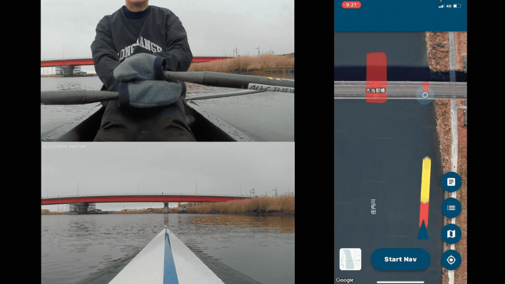
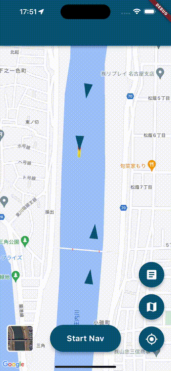
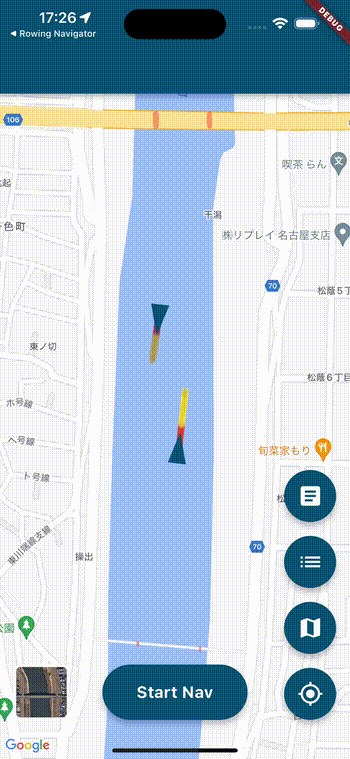

# Rowing Navigator

## 概要

Rowing Navigator はローイングの安全な航行を支援するアプリです。
艇の航行状況や危険な水域をマップ上にリアルタイムに可視化し、他艇や危険な水域への接近を検知して音声による衝突警告を行います。

本アプリは、大羽俊輔の修士研究において開発されました。修士論文は[こちら](https://github.com/obashun22/master_thesis)からご覧いただけます。

### デモ動画

<div align="left">
<a href="https://www.youtube.com/watch?v=7UsPkerIZm0" target="_blank" style="position: relative; display: inline-block;">
  
  <div style="position: absolute; top: 50%; left: 50%; transform: translate(-50%, -50%); width: 80px; height: 80px; background-color: rgba(255, 0, 0, 0.8); border-radius: 50%; display: flex; align-items: center; justify-content: center; cursor: pointer;">
    <div style="width: 0; height: 0; border-left: 30px solid white; border-top: 20px solid transparent; border-bottom: 20px solid transparent; margin-left: 8px;"></div>
  </div>
</a>
<br>
<a href="https://www.youtube.com/watch?v=7UsPkerIZm0" target="_blank">https://www.youtube.com/watch?v=7UsPkerIZm0</a>
</div>

<details>
<summary>アプリ画面はこちら</summary>
<div align="left">


</div>
</details>

### 目次

1. [起動方法](#起動方法)
1. [セットアップ](#セットアップ)
1. [主な機能](#主な機能)
1. [使い方](#使い方)
1. [桜川(土浦市)での運用](#桜川土浦市での運用)
1. [現在の課題](#現在の課題)
1. [ライセンス](#ライセンス)
1. [謝辞](#謝辞)

アプリの設計について詳しく知りたい場合は、 [設計書](./docs/DESIGN.md) を参照してください。

## 起動方法

アプリを起動する前に API Key と Firebase のセットアップが必要です。

```bash
$ flutter pub get
$ flutter run
```

### 静的解析について

本リポジトリの作業パスに日本語が含まれる場合、Dart analysis server の LSP チャネルが
ヘッダのバイト長と UTF-16 長を取り違えてクラッシュするため、`flutter analyze` を実行できません。
ローカルでは代わりに `dart analyze lib test tool` を使用してください。
`flutter analyze` と `flutter test` は、ASCII パスで動作する GitHub Actions
(`.github/workflows/ci.yml`)で担保しています。

`tool` を対象から外さないでください。`tool/` 配下の再生ツールは `lib/` のモデルを
直接呼ぶため、`lib test` だけを解析するとローカルは緑のまま、プロジェクト全体を見る
CI の `flutter analyze` だけが落ちます。

危険区域データ(`assets/data/sakuragawa_obstacles.json`)を編集した場合は、
`tool/update_hazard_profile_hash.sh` を実行してチェックサムを更新してください。

### サポートバージョン

下記のバージョンで動作確認を行っています。

| Tool                 | Version                      |
| -------------------- | ---------------------------- |
| Flutter              | 3.44.5（2026-07-20公開前検証） |
| Dart                 | 3.12.2（2026-07-20公開前検証） |
| Real iOS Machine     | iPhone 16 Pro (iOS 18.5)     |
| iOS Simulator        | iPhone 15 Pro Max (iOS 17.5) |
| Real Android Machine | Google Pixel 7 (Android 14)  |
| Android Simulator    | Not tested                   |

## セットアップ

### API Key

各サービスの API Key を取得して、次のとおり適切に配置してください。  
API Key の取得に際して、各サービスでのプロジェクト作成が必要です。

| Service     | Platform      | Description                                                                                                                   |
| ----------- | ------------- | ----------------------------------------------------------------------------------------------------------------------------- |
| Firebase    | iOS & Android | [Firebase の公式ドキュメント](https://firebase.google.com/docs/flutter/setup?hl=ja&platform=ios)に従い API Key を設定         |
| Google Maps | iOS           | `ios/Flutter/Secrets.xcconfig.example`を`Secrets.xcconfig`へ複製し、制限済みAPI keyを設定 |
|             | Android       | [Google Maps Platform](https://console.cloud.google.com/google/maps-apis) の API key を`android/secret.properties` に設定     |

### Firebase

Rowing Navigator は、固定危険区域を端末内に同梱し、通信できない場合も表示します。臨時危険区域と固定流木の最新更新値だけをFirestoreから取得します。

#### Firestore

Firestore は、工事などの臨時危険区域と、固定流木の位置・大きさ・向きの更新値を共有するために使用します。固定流木を含む基準形状は `assets/data/sakuragawa_obstacles.json` に同梱し、Firestoreが空またはオフラインでも危険区域が消えないようにします。

> 以下のアプリ側機能は2026-07-20時点で実装済みです。FirebaseコンソールのFirestore Rulesは手動で更新する必要があります。

| Collection | 用途 |
|---|---|
| `teams/{teamId}/temporary_obstacles` | 手動で削除するまで残るチーム共有の臨時危険区域 |
| `teams/{teamId}/managed_hazards` | 失効しないチーム共有の固定流木変形値 |

臨時危険区域は、同一チームのメンバーが作成者に関係なく編集・削除でき、手動で削除するまで残ります。固定流木も失効せず、同一チームの全メンバーが位置・長さ・幅・向きを更新できますが、削除はできません。

> **一般公開前の必須作業:** チーム招待/所属確認、チーム別データ分離、チーム全員の危険区域編集はコードとRulesへ実装済みで、Rules Emulator 25件に合格しています。異なる2チームの実端末試験後に本番Rulesを公開してください。

Firestore Rulesは、チーム所属を検証した上で`temporary_obstacles`の全メンバー共同編集、`managed_hazards`の全メンバー更新・削除禁止、形状・時刻・revisionの検証を設定します。リポジトリ直下の`firestore.rules`と`database.rules.json`が確定候補です。旧ルールのままでは新しい保存先への書き込みが拒否されるため、実機確認前に必ず公開してください。詳細は[チーム招待制・無料枠・省電力設計](./docs/design_notes/2026-07-20_チーム招待制・無料枠・省電力設計.md)を参照してください。

以前の `static_obstacles` コレクションはアプリから参照しなくなりました。削除しなくても動作に影響しません。

### Android公開署名

releaseビルドはdebug鍵へフォールバックしません。初回だけ、`android/key.properties.example`を`android/key.properties`へコピーし、Play Console用のupload keystore情報を設定してください。keystoreと`key.properties`はGitへ登録しません。未設定のままreleaseビルドすると、誤署名を防ぐため意図的に失敗します。

#### Firebase Authentication

Rowing Navigator ではチーム所属を保護するため、画面には出さないFirebase Anonymous Authenticationを使用しています。チーム作成または固定招待コード参加は初回だけで、参加済み端末は保存済みUIDと所属を起動時に自動復元します。新規チームの招待コードは12文字（`XXXX-XXXX-XXXX`）で、チーム画面や作成完了画面から共有できます。更新前に発行済みの20文字コードも引き続き利用できます。アプリデータ消去などで認証が実際に失われた場合だけ、保存された固定コードを確認して再参加します。

Firebase Authentication で次のログインプロバイダを有効にする必要があります。Identity Platformの匿名アカウント30日自動クリーンアップは、固定UIDと所属を維持するため必ずOFFにしてください。

| Provider |
| -------- |
| 匿名     |

## 主な機能

| 機能             | 概要                                                               |
| ---------------- | ------------------------------------------------------------------ |
| チーム招待       | 初回にチームを作成、または固定招待コードで参加。次回以降は自動接続 |
| 水域情報表示     | 水域マップ上に危険な水域や航行中の艇の位置・針路をリアルタイム表示 |
| 名前共有         | 航行開始時に入力した名前を、監視地図と艇一覧へ表示                 |
| 衝突警告         | 他艇や静的障害物への接近時に音声で警告                             |
| 水域マップ編集   | 臨時危険区域の共同編集と固定流木の位置・サイズ更新                   |
| マップ表示切替   | 通常地図と航空写真の表示切替機能                                   |
| 航行情報記録機能 | 航行情報を記録・共有／研究目的で実装した機能                       |

### 今後の展望

公開後に実装したい機能は、[今後実装したい機能](./docs/今後実装したい機能.md)へ集約します。新しい将来機能が出た場合も、この文書へ追加します。

次のような機能拡張が考えられます。

| 機能             | 概要                                                                 |
| ---------------- | -------------------------------------------------------------------- |
| 航行情報表示機能 | 自艇の航行情報（航路・艇速・レート・航行距離など）をリアルタイム表示 |
| 航行情報記録機能 | 航行情報を記録・表示・共有                                           |
| 救難信号機能     | 緊急時に救難信号を発信し、他艇に通知                                 |

## 使い方

### 水域の状況を確認する

アプリを起動すると水域マップが表示され、アプリに同梱した固定危険区域を確認できます。他艇の位置と臨時危険区域は、「航行スタート」または「監視スタート」後に表示されます。
また、水域マップ表示切替機能を使用して、通常地図と航空写真を切り替えることができます。  
本機能は、乗艇時以外でも使用することができます。

観察者モードのホームでは、「メニュー」→「障害物の追加」から臨時危険区域と固定流木を編集します。「安全設定」では危険区域の幅、警告開始時間、プライバシー等を確認できます。開発用情報を開く「詳細」は、デバッグ版のメニュー内にだけ表示します。

### 衝突警告を行う

乗艇中に衝突警告を行うには、水域マップ画面下の「航行スタート」から、航行する人の「名前」、艇種、端末の位置を設定してナビゲーションモードをオンにします。名前は20文字以内の必須項目で、ニックネームも使用できます。ナビゲーションモードでは、自艇の将来経路を連続的に掃引し、他艇または静的障害物との接触候補を検出します。他艇は双方の速度・針路を同じ時刻で進めて判定し、設定秒数以内に接触が見込まれる場合だけ警告します。
また、ナビゲーションモードでは入力した名前と自艇の航行情報が他の端末と共有され、監視画面の地図アイコンと艇一覧に名前が表示されます。航行終了時には、Realtime Database上の名前と位置情報を削除します。
本機能は、乗艇時の使用を想定しています。

⚠️ 警告は音声で行われるため、端末の音量は中程度に設定してください  
⚠️ 物理予測の針路はGPSで観測した移動方向を使い、低速時は最後の信頼できる針路を保持します。端末の地磁気方位は衝突予測に使用しません

### 水域マップを編集する

通常の固定危険区域は `assets/data/sakuragawa_obstacles.json` を編集してアプリをビルドし直します。臨時危険区域は「障害物の追加」から登録し、同一チームの全メンバーが編集・削除できます。固定流木も同一チームの全メンバーが、同梱形状を削除せずに位置・長さ・幅・向きを更新できます。

## 桜川(土浦市)での運用

本リポジトリは、茨城県土浦市の桜川でのボート練習向けに調整されています。

### 桜川向けの主な変更点

| 変更 | 内容 |
| ---- | ---- |
| 危険区域プリセット | `assets/data/sakuragawa_obstacles.json` に桜川の固定危険区域を定義。固定流木は内側全体を塗りつぶし、Firestoreには位置・サイズ等の変形値だけを保存 |
| 画面警告バナー | 複数警告を画面上部に省スペース表示。対象別の色と、現在危険（濃色）／推測危険（淡色・約N秒後）を区別 |
| 対象別の警告音 | 岸・橋・中州・流木・他艇・カーブ・逆走注意は、条件と解除確認が続く間ループ再生。カーブと重なる逆走注意を優先 |
| 危険区域への近接補助 | 連続掃引に加え、危険区域へ接近中・極近距離・低速で方位不明の場合に `obstacleProximityCautionDistance`(既定15m)を補助判定に使用 |
| 幽霊艇の除外 | サーバー時刻基準で更新から6秒未満だけ新規予測し、6〜30秒は既存警告の安全解除根拠にせず、30秒超で艇情報を破棄 |
| **Realtime Database移行** | 位置共有を Firestore(操作回数課金)から Realtime Database(転送量課金)に移行。実際の料金は接続数・転送量・Firebaseの契約条件に依存 |
| **適応送信** | 停止中は10秒間隔・周囲300mに他艇がいなければ5秒間隔・他艇近傍で安全なら2秒間隔・リスク時は1秒間隔で送信。受信側は推測航法で補間。**リスク評価は送信間隔に関係なく毎秒実行されるため、危険区域への警告は影響を受けない** |
| **GPSストリーム化** | 毎秒のポーリングから位置ストリーム購読に変更し電池効率を改善 |
| **コーチモード(監視)** | 観察者モードの地図と艇一覧に名前を表示。艇一覧パネル(速度・電池残量・最終更新)、航跡表示、異常検知(長時間停止・更新途絶)を追加 |
| **練習ログ** | ナビゲーション終了時に自動保存。距離・タイム・最高速度・平均ペース・500mスプリット・ピース自動検出。GPX出力で**Stravaにアップロード可能** |
| **ストロークレート計測** | 加速度センサから艇の周期的な加速を検出しSPMを算出・記録 |
| **電池残量共有** | 各艇の電池残量を位置情報と一緒に共有し、コーチ画面に表示 |
| 設定値の整理 | 設定値を `lib/config/` 配下に集約しコメントを追記 |

### 危険区域データの追加・修正

危険区域データは次の2つの方法で管理できます。

**方法1: JSONファイルで管理する(推奨・記録が残る)**

1. `assets/data/sakuragawa_obstacles.json` を開く
2. `obstacles` 配列に区域を追加・修正する。各区域は3点以上の `points`(緯度経度)を持つ
3. アプリをビルドし直す

固定危険区域はアプリ内に同梱されるため、Firestoreへの全頂点の取り込みは不要です。固定流木だけは位置・サイズ・向きの小さな更新値を共有しますが、アプリ上から削除はできません。

旧データとのハッシュ互換を保つため、JSONに `practiceArea` と
`operationalCoveragePolygon` が残っている版がありますが、アプリはこれらを
読み込まず、水域の内外による表示・警告・監視判定には使用しません。

**方法2: アプリ上で直接描く(現地での微調整向け)**

水域マップ編集画面で臨時危険区域を登録します。登録内容はFirestoreのチーム別pathに保存され、同一チームの全メンバーが編集・削除できます。固定流木を選ぶと、位置・長さ・幅・向きを編集できます。操作中は端末内だけでプレビューし、「保存」を押した時だけ1回通信します。臨時危険区域と固定流木は自動失効しません。固定流木の削除は行いません。

⚠️ 同梱のプリセット座標は**サンプル(仮置き)**です。実艇で使用する前に、必ず現地の実際の危険箇所(橋脚・杭・浅瀬・係留船など)に合わせて修正してください。

### 警告設定の調整

警告の感度は `lib/config/risk_evaluator_config.dart` で調整します。

| 設定値 | 既定値 | 意味 |
| ------ | ------ | ---- |
| `warningTime` | 10.0秒前 | 危険区域への到達予測に対する初回警告の目標時間。アプリ内で9〜25秒前に変更可能。下限9秒は最長の停止時間(8+の8.15秒)より短い地平を選べないようにするため |
| `shore.landSideMeters` | 15.0m | 岸基準線の陸側にデフォルトで伸ばす距離。水上側の接近補助距離とは別 |
| `obstacleProximityCautionDistance` | 15.0m | 接近中・極近距離・低速で方位不明の場合に使う近接補助距離。大きくすると過剰警告になりやすい |
| `boatPredictionTimeoutSeconds` | 6秒 | 他艇の新規衝突予測に使える鮮度上限 |
| `boatStaleTimeoutSeconds` | 30秒 | 他艇表示の有効期限（6〜30秒は新規予測不可） |
| `evalIntervalDistance` | 2m | 地図上の予測領域表示の間隔（衝突判定本体は連続掃引） |
| `positionUpdateInterval`(navigator_config.dart) | 1秒 | リスク評価・記録の周期(送信周期ではない) |
| `sendIntervalStoppedSec`(navigator_config.dart) | 10秒 | 停止中の送信間隔 |
| `sendIntervalNoOthersNearbySec`(navigator_config.dart) | 5秒 | 周囲に他艇がいないときの送信間隔 |
| `nearbyBoatRadius`(navigator_config.dart) | 300m | 「他艇が近い」と判定する半径 |

推測警告の余裕は、観察者モードのホームにある「メニュー」→「安全設定」で変更し、「保存」を押します。設定は端末ごとに保存されます。

警告はTTS読み上げや段階別ビープではありません。岸・橋・他艇・カーブ・逆走注意などは、条件成立中と解除確認中に録音音声をループ再生します。カーブ中に逆走注意が成立した場合は、逆走注意が音声を直ちに割り込みます。GPS・通信などの継続異常は一定間隔で再通知します。複数対象は対象色のコンパクトなチップで同時表示し、推測危険は同系淡色と「約N秒後に危険」で現在危険と区別します。旧アプリから `shore_warning.mp3`、`bridge_warning.mp3`、`island_warning.mp3`、`driftwood_warning.mp3`、`curve_warning.mp3`、`reverse_warning.mp3`、`test_warning.mp3`、`add_warning.mp3` を `assets/audio/` へ移植済みです。標準の割り当ては `lib/config/warning_audio_config.dart` で管理します。

区域ごとに別の音声を使う場合は、`assets/data/sakuragawa_obstacles.json` の対象区域または基準線に、次のように `warningAudio` を追加します。音声ファイルも `assets/audio/` に置いてからアプリをビルドし直してください。

```json
"warningAudio": "audio/custom_bridge_warning.mp3"
```

コーチ(監視)関連は `lib/config/coach_config.dart`、練習ログ関連は `lib/config/log_config.dart`、レート計測は `lib/config/stroke_rate_config.dart` で調整できます。コーチから艇への指示機能は使用せず、運用上の指示はトランシーバーで行います。

### Realtime Database のセットアップ(必須)

位置共有は Realtime Database(RTDB)を使用します。初回のみ以下の設定が必要です。

1. [Firebaseコンソール](https://console.firebase.google.com/) → 対象プロジェクト → 「Realtime Database」→「データベースを作成」(ロケーションは `asia-southeast1` 推奨)
2. AuthenticationでAnonymousを有効化する。匿名アカウントの30日自動削除は有効化しない
3. Android Studio内蔵JDKを使って、リポジトリのRules Emulator 25件を実行する

```bash
JAVA_HOME='/Applications/Android Studio.app/Contents/jbr/Contents/Home' \
firebase emulators:exec \
  --project demo-rowing-team-rules \
  --only database,firestore \
  'npm --prefix firebase_rules_test test'
```

4. 合格したリポジトリ直下の`database.rules.json`と`firestore.rules`を本番projectへデプロイする。旧グローバルpathの`auth != null`ルールを再利用しない
5. App CheckへAndroid Play IntegrityとiOS App Attest/DeviceCheckを登録し、Monitorで正規配布版を確認してからRTDB/FirestoreをEnforceする
6. `flutterfire configure`を再実行して`firebase_options.dart`にdatabaseURLを反映するか、`lib/config/navigator_config.dart`の`realtimeDatabaseUrl`へデータベースURLを設定する

共有pathは`teams/{teamId}/live_positions/{uid}`と`teams/{teamId}/boat_profiles/{uid}`である。初回送信と再接続時はprofileと最新位置をルート更新で原子的に公開する。未認証、未所属、別チーム、他UID位置write、メンバーUID一覧取得はRulesで拒否する。

他艇メッセージは、旧データや別セッションの混入を避けるため**プロトコル版と危険区域profile版**を厳密に検証します。**アプリ版(appVersion)は互換の判断に使いません。**全員が同時に更新を終える瞬間は存在しないため、アプリ版の一致を求めると、配信のたびに混在期間中のどちらかの群が互いの地図から消え、衝突警告の対象から外れてしまいます。通信スキーマ自体を変えるときだけ`lib/config/protocol_config.dart`の`currentPositionProtocolVersion`を上げ、**RTDBルールを先にデプロイしてからアプリを配信してください**(逆順だと新アプリが古いルールに弾かれます)。危険区域profileを更新した場合も同様に、`protocol_config.dart`とルールのversionを同じリリースで更新します。

危険区域JSONはSHA-256でも検証します。`assets/data/sakuragawa_obstacles.json`を意図的に更新したときだけ、`shasum -a 256 assets/data/sakuragawa_obstacles.json`の結果を`PresetObstacleService.expectedProfileSha256`へ反映してください。release版では陸上`testZone`と端末ごとの危険区域幅変更を無効化します。

RTDBを使わず従来のFirestoreに戻す場合は `useRealtimeDatabaseForPositions` を `false` にしてください(通信コスト大)。

### コーチモード(監視)の使い方

ナビゲーションを開始せず、観察者画面の「監視スタート」を押した端末がコーチ用です。「監視終了」を押すとFirebaseとの位置共有受信を停止します。

- 人型アイコン: 艇一覧パネルの表示切替(速度・電池残量・最終更新・異常)
- 地図上: 各艇の航跡(直近10分)を表示
- 異常検知: 長時間停止(3分)・更新途絶(45秒)を検知すると画面で通知

### 練習ログの使い方

ナビゲーションを終了すると記録が自動保存されます。リストアイコン → 練習記録から、距離・タイム・平均ペース・500mスプリット・自動検出されたピース(漕いだ区間)を確認できます。

- **GPX共有**: Stravaの「アクティビティをアップロード」にそのまま使えます(無料)
- **CSV共有**: 表計算ソフトでの分析用
- 記録は端末内にのみ保存されます(サーバー送信なし・費用ゼロ)

ストロークレート(SPM)は端末の重力除去3軸加速度で計測します。端末を艇体にしっかり固定し、漕ぎ始めてから少なくとも4ストローク待ってください。端末の向きは自動補正しますが、手持ち・緩いホルダー・波で大きく揺れる場所では、誤値を出す代わりに`--`表示となります。初回使用時はコーチの目視カウントまたはSpeedCoachと突き合わせて確認してください。

### テスト手順

**1. 自動テスト(実艇の前に必ず実行)**

```bash
$ flutter pub get
$ flutter analyze
$ flutter test
```

衝突判定ロジック・距離計算・警告バナーの単体テストが実行されます。

**2. 陸上での動作確認**

1. 2台の端末でアプリを起動し、両方でナビゲーションを開始する
2. 互いの艇マーカーが地図上に表示されることを確認する
3. 端末を持って歩き、位置・針路が追従することを確認する
4. `assets/data/sakuragawa_obstacles.json` に現地確認済みの固定危険区域を設定してビルドし直し、固定流木の内側全体が両端末で塗りつぶされることを確認する
5. 「障害物の追加」から臨時危険区域を登録し、別端末から編集・削除できることを確認する。臨時危険区域と固定流木が24時間経過後も残ることを確認する。固定流木は位置・サイズを更新できるが、削除はできないことを確認する
6. 危険区域へ進み、対象名のバナーと対応する録音音声が出て、解除確認中も音が途切れないことを確認する
7. 片方のアプリを強制終了し、6秒以降はその艇を新規予測せず、30秒超で地図から消え、警告中だった場合は他艇情報途絶表示へ切り替わることを確認する
8. 航行中の端末を3分静止させ、コーチ端末に「長時間停止」が通知されることを確認する
9. ナビゲーションを終了し、練習記録に距離・スプリットが保存されていることを確認する

航行開始前の設定シートで「音声を確認する」を押し、録音済み警告音が実際に聞こえることを確認してください。TTSは使用しません。iPhoneのサイレントスイッチに関わらず再生する設定ですが、端末のメディア音量は中程度以上に設定してください。

**公開前の必須確認**

1. `assets/data/sakuragawa_obstacles.json` の危険区域と詳細航路データを確定する
2. Firebase Authentication、Firestoreルール、RTDBルール・`databaseURL`を本番プロジェクトで確認する
3. 同じアプリ版を入れた2台で、交差・追越し・正面接近・並走・受信断・GPS断を一括試験する
4. iOS/Android実機で、サイレントスイッチ、画面消灯、Bluetooth接続/切断、音量変更後も警告音が継続・復旧することを確認する
5. 各艇種で端末の固定方向を確認し、地図上で進行方向が常に画面下側になることを確認する
6. Androidのproduction signingと、iOSのDistribution証明書・Provisioning Profileでarchiveできることを確認する

**3. 公開判定用の実艇一括試験**

1. 公開候補と同じ版を2台以上へ入れ、救助艇を配置した管理水域で実施する
2. 1回の試験枠で、停止・低速確認から交差・追越し・正面接近、GPS断、通信断、画面消灯、音声出力切替まで上のチェック項目を通す
3. 1項目でも不合格なら部分的に公開せず、修正後に同じ一括チェックを最初から再実行する

### 安全上の注意

- **本アプリは衝突回避を保証するものではありません。** 安全確認を補助するツールであり、目視確認・声かけなど従来の安全確認を必ず併用してください。
- GPS誤差(数m〜十数m)、通信遅延、電池切れ、端末の故障などにより、警告が出ない・遅れることがあります。
- 端末の音量は中程度以上に設定し、乗艇前に音声警告が鳴ることを確認してください。
- 端末を艇体へ確実に固定してください。物理予測は端末の地磁気方位を使わず、GPSで観測した移動方向を使用します。
- 荒天時・夜間・増水時は練習自体を中止してください。アプリの有無に関係なく判断してください。
- 電池消費が大きいため、長時間の練習ではモバイルバッテリーの携行を推奨します。

## 現在の課題

| 課題                                                       | 概要                                                                                                                               |
| ---------------------------------------------------------- | ---------------------------------------------------------------------------------------------------------------------------------- |
| バッテリー消費量の実艇検証                                 | 適応送信と差分購読は実装済み。画面点灯2時間・画面消灯・低電池で12台実測が必要                                                     |
| 測位誤差の低減                                             | スマートフォンの GPS 精度に依存しており、誤差が発生する                                                                            |
| 欠落したセンサ値の補完                                     | 位置情報が断続的に欠落する場合があり、補完手法の検討が必要                                                                         |
| 端末の設置方向の改善                                       | 現在は端末を艇の針路方向に向ける必要があるため漕手にとって見ずらく改善が必要                                                       |
| 低速時の方位精度                                           | GPS移動量が小さい間は直前の信頼方位を保持するため、停止直後の変針反映には遅れがあり得る                                               |
| Firebase使用量の継続監視                                   | クラウド送信は最短2秒、遠距離5秒、停止10秒。端末内警告は常時1秒。compact payloadと過頻度Rules拒否を実装済み                       |
| 無料枠内運用の確定                                         | 12台×2時間でRTDB download増分200MB以下を合格値として実測し、月予測6GB以下を維持する                                                |
| 場所を変えても動作するかの検証                             | GPS 精度や地理計算について国外での動作検証が未実施                                                                                 |
| 近隣の艇情報のみ取得                                       | アプリの負荷低減のため水域周辺の艇情報のみを取得・表示する仕組みの実装が必要                                                       |

## ライセンス

本プロジェクトは、Apache License 2.0 のもとで公開されています。  
詳細は [LICENSE](./LICENSE) および [NOTICE](./NOTICE) をご参照ください。

## 謝辞

研究を指導して下さいました名古屋大学情報学研究科高田・松原研究室の高田先生、松原先生、および数多くの助言を頂いた情報プラットフォーム論講座の皆様に深く感謝申し上げます。
また、データ収集や動作試験において多大なご協力をいただいた名古屋大学漕艇部の皆様にも深く感謝申し上げます。
