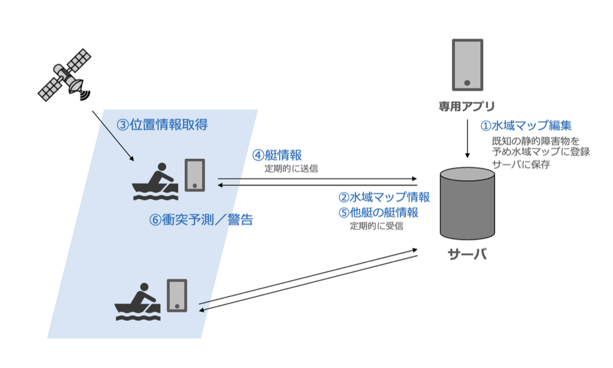

# 設計書

## 目次

## 1. 概要

### 1.1. プロジェクト概要

Rowing Navigator はローイングの安全な航行を支援するアプリです。
艇の航行状況や危険な水域をマップ上にリアルタイムに可視化し、他艇や危険な水域への接近を検知して音声による衝突警告を行います。

本アプリは、大羽俊輔の修士研究において開発されました。修士論文は[こちら](https://github.com/obashun22/master_thesis)からご覧いただけます。本アプリが開発された経緯やシステムの詳細については修士論文をご覧ください。

### 1.2. 技術スタック

#### 1.2.1. ライブラリ

| カテゴリ             | 技術・ライブラリ                                                   | 用途・備考                                               |
| -------------------- | ------------------------------------------------------------------ | -------------------------------------------------------- |
| **アプリ基盤**       | Flutter, Dart                                                      | クロスプラットフォーム開発（iOS/Android）                |
| **UI/UX**            | Flutter Hooks, Cupertino Icons                                     | フックベース UI 設計、iOS 風アイコン                     |
| **状態管理**         | Riverpod                                                           | hooks_riverpod として使用                                |
| **マップ・位置情報** | Google Maps Flutter, Geolocator, Flutter Compass, Flutter Map Math | マップ表示・操作、GPS 測位、方位取得、地図計算           |
| **データ管理**       | Firebase Core, Firebase Auth, Cloud Firestore, Shared Preferences  | バックエンド基盤、認証、NoSQL データベース、ローカル保存 |
| **リアクティブ処理** | RxDart                                                             | ストリーム処理                                           |
| **音声**             | AudioPlayers                                                       | 衝突警告音などの音声再生                                 |
| **計算処理**         | Vector Math                                                        | ベクトル計算（衝突検知アルゴリズム等）                   |
| **端末制御**         | Wakelock Plus                                                      | 画面常時点灯（航行中の画面保持）                         |
| **共有機能**         | Share Plus                                                         | データ共有（CSV 形式での記録共有）                       |

#### 1.2.2. 外部サービス

| サービス名           | 用途・備考 |
| -------------------- | ---------- |
| Google Maps Platform | 地図表示   |
| Firebase             | 認証・DB   |

### 1.3. 開発環境

以下のバージョンで動作確認を行っています。

| プラットフォーム | カテゴリ          | バージョン                   |
| ---------------- | ----------------- | ---------------------------- |
| iOS              | Actual Machine    | iPhone 16 Pro (iOS 18.5)     |
|                  | iOS Simulator     | iPhone 15 Pro Max (iOS 17.5) |
| Android          | Actual Machine    | Google Pixel 7 (Android 14)  |
|                  | Android Simulator | 未確認                       |

## 2. システムアーキテクチャ

### 2.1. 全体構成

Rowing Navigator のシステム構成は以下の図の通りです。



### 2.2. ディレクトリ設計

#### 2.2.1. 主要ディレクトリ構成

```
lib/
├── main.dart                    # アプリケーションのエントリーポイント
├── firebase_options.dart        # Firebase設定
├── screens/                     # 画面コンポーネント
├── hooks/                       # カスタムフック
├── models/                      # データモデル
├── services/                    # ビジネスロジック・外部サービス連携
├── providers/                   # Riverpodプロバイダー
├── types/                       # 型定義・列挙型
├── utils/                       # ユーティリティ関数
├── api/                         # API通信層
├── config/                      # 設定ファイル
├── widgets/                     # 共通ウィジェット
└── features/                    # 機能別モジュール
    └── home_map/
        └── widgets/             # 機能固有のウィジェット
```

#### 2.2.2. 各ディレクトリの役割

| ディレクトリ   | 役割                                           | ファイル                                                                                                                                                                                                                                                                                                                                                                                                                                                |
| -------------- | ---------------------------------------------- | ------------------------------------------------------------------------------------------------------------------------------------------------------------------------------------------------------------------------------------------------------------------------------------------------------------------------------------------------------------------------------------------------------------------------------------------------------- |
| **screens/**   | アプリケーションの画面を定義                   | `home_map_screen.dart` (メインのマップ画面)<br>`record_list_screen.dart` (航行記録一覧画面)<br>`area_setting_screen.dart` (水域マップ編集画面)                                                                                                                                                                                                                                                                                                          |
| **hooks/**     | カスタムフックによる状態管理とビジネスロジック | `useNavigator.dart` (ナビゲーション機能のフック)<br>`useNavMap.dart` (マップ操作のフック)<br>`useAlert.dart` (アラート機能のフック)<br>`useMapEditor.dart` (マップ編集機能のフック)<br>`useTracking.dart` (追跡機能のフック)                                                                                                                                                                                                                            |
| **models/**    | データモデルの定義                             | `boat_model.dart` (艇の情報モデル)<br>`nav_config_model.dart` (ナビゲーション設定モデル)<br>`message_model.dart` (メッセージモデル)<br>`static_obstacle_model.dart` (静的障害物モデル)                                                                                                                                                                                                                                                                  |
| **services/**  | ビジネスロジックと外部サービス連携             | `collision_risk_evaluator_service.dart` (衝突リスク評価サービス)<br>`ship_domain_service.dart` (船舶領域サービス)<br>`message_service.dart` (メッセージサービス)<br>`dynamic_obstacle_service.dart` (動的障害物サービス)<br>`static_obstacle_service.dart` (静的障害物サービス)<br>`env_service.dart` (環境設定サービス)<br>`permission_service.dart` (権限管理サービス)<br>`geo_service.dart` (位置情報サービス)<br>`auth_service.dart` (認証サービス) |
| **types/**     | 型定義と列挙型の管理                           | `ship_domain_type.dart` (船舶領域タイプ)<br>`boat_type.dart` (艇タイプ)<br>`alert_type.dart` (アラートタイプ)<br>`collision_risk_level.dart` (衝突リスクレベル)<br>`safety_level.dart` (安全レベル)<br>`map_editor_mode.dart` (マップ編集モード)<br>`tracking_mode.dart` (追跡モード)<br>`nav_mode.dart` (ナビゲーションモード)<br>`marker_type.dart` (マーカータイプ)                                                                                  |
| **utils/**     | 汎用的なユーティリティ関数                     | `heading.dart` (方位計算)<br>`triangulation.dart` (三角測量)<br>`geo_math.dart` (地理計算)<br>`sat_algorithm.dart` (SAT アルゴリズム)<br>`self_intersection.dart` (自己交差判定)<br>`winding_algorithm.dart` (巻き数アルゴリズム)<br>`mean_lat_lng.dart` (平均緯度経度計算)<br>`image2icon.dart` (画像からアイコン変換)                                                                                                                                 |
| **api/**       | 外部 API との通信層                            | `staticObstacleAPI.dart` (静的障害物 API)<br>`messageAPI.dart` (メッセージ API)<br>`userAPI.dart` (ユーザー API)                                                                                                                                                                                                                                                                                                                                        |
| **config/**    | アプリケーション設定                           | `risk_evaluator_config.dart` (リスク評価設定)<br>`navigator_config.dart` (ナビゲーター設定)<br>`boat_config.dart` (艇設定)                                                                                                                                                                                                                                                                                                                              |
| **providers/** | Riverpod プロバイダーの定義                    | `nav_config_providers.dart` (ナビゲーション設定プロバイダー)                                                                                                                                                                                                                                                                                                                                                                                            |
| **widgets/**   | 共通ウィジェット                               | `RoundedIconButton.dart` (丸角アイコンボタン)                                                                                                                                                                                                                                                                                                                                                                                                           |
| **features/**  | 機能別モジュール化                             | `home_map/widgets/NavStatusCard.dart` (ナビゲーション状態カード)<br>`home_map/widgets/NavSettingModal.dart` (ナビゲーション設定モーダル)<br>`home_map/widgets/RoundedButton.dart` (丸角ボタン)<br>`home_map/widgets/MapTypeSwitcher.dart` (マップタイプ切替)<br>`home_map/widgets/BoatStatusCard.dart` (艇状態カード)                                                                                                                                   |

## 3. フロントエンド設計

### 3.1. 画面設計

Rowing Navigator で提供される画面は以下の通りです。

| 画面名                 | ファイル名                 | 役割・機能                                                                                                             |
| ---------------------- | -------------------------- | ---------------------------------------------------------------------------------------------------------------------- |
| **水域マップ画面**     | `home_map_screen.dart`     | メインの航行支援画面<br>• リアルタイム位置・針路表示<br>• 他艇の位置・針路表示<br>• 危険水域の可視化                   |
| **ナビゲーション画面** | `home_map_screen.dart`     | ナビゲーション画面<br>• リアルタイム位置・針路表示<br>• 衝突警告機能<br>• 自他艇の位置・針路表示<br>• 危険水域の可視化 |
| **水域マップ編集画面** | `area_setting_screen.dart` | 障害物領域の編集画面<br>• 静的障害物領域の作成・削除                                                                   |
| **航行記録一覧画面**   | `record_list_screen.dart`  | 航行記録の管理画面<br>• 記録の一覧表示<br>• 記録の詳細表示<br>• 記録の削除・共有                                       |

#### 3.1.1. 画面遷移

```plaintext
水域マップ画面
├── ナビゲーション画面
├── 水域マップ編集画面
├── 航行記録一覧画面
    └── 記録詳細画面
```

### 3.2. アーキテクチャ

#### 3.2.1. レイヤー構成

Rowing Navigator は以下のレイヤー構成を採用しています：

```
┌─────────────────────────────────────┐
│           Presentation Layer        │ ← 画面・UI
├─────────────────────────────────────┤
│            Hooks Layer              │ ← 状態管理・ビジネスロジック
├─────────────────────────────────────┤
│           Services Layer            │ ← 外部サービス連携・計算処理
├─────────────────────────────────────┤
│            API Layer                │ ← Firebase通信
├─────────────────────────────────────┤
│           Models Layer              │ ← データモデル
└─────────────────────────────────────┘
```

#### 3.2.2. サービス層の役割分担

| サービス名                        | ファイル名                              | 役割                                                                   |
| --------------------------------- | --------------------------------------- | ---------------------------------------------------------------------- |
| **EnvService**                    | `env_service.dart`                      | 環境情報の統合管理<br>• 動的障害物（他艇）の取得<br>• 静的障害物の管理 |
| **CollisionRiskEvaluatorService** | `collision_risk_evaluator_service.dart` | 衝突リスク評価<br>• 位置予測<br>• 衝突判定<br>• リスクレベル算出       |
| **ShipDomainService**             | `ship_domain_service.dart`              | 船舶領域計算<br>• 船体領域の生成<br>• 排他領域の生成                   |
| **MessageService**                | `message_service.dart`                  | メッセージ通信<br>• 位置情報の送信<br>• 他艇情報の受信                 |
| **DynamicObstacleService**        | `dynamic_obstacle_service.dart`         | 動的障害物管理<br>• 他艇情報の変換<br>• 動的障害物ストリーム提供       |
| **StaticObstacleService**         | `static_obstacle_service.dart`          | 静的障害物管理<br>• 障害物の CRUD<br>• 静的障害物ストリーム提供        |
| **GeoService**                    | `geo_service.dart`                      | 位置情報取得<br>• GPS 位置の取得                                       |
| **AuthService**                   | `auth_service.dart`                     | 認証管理<br>• 匿名認証                                                 |
| **PermissionService**             | `permission_service.dart`               | 権限管理<br>• 位置情報権限                                             |

#### 3.2.3. フック層の役割分担

| フック名         | ファイル名          | 役割                                                                                                   |
| ---------------- | ------------------- | ------------------------------------------------------------------------------------------------------ |
| **useNavigator** | `useNavigator.dart` | ナビゲーション機能の統合<br>• 位置情報の取得・処理<br>• 衝突リスク評価<br>• アラート制御<br>• 記録管理 |
| **useNavMap**    | `useNavMap.dart`    | マップ操作の管理<br>• マーカー・ポリゴン・ポリラインの描画<br>• マップタイプの制御                     |
| **useAlert**     | `useAlert.dart`     | アラート機能の管理<br>• 音声警告の再生<br>• アラート状態の管理                                         |
| **useMapEditor** | `useMapEditor.dart` | マップ編集機能<br>• 障害物領域の作成・削除<br>• 描画操作の管理                                         |
| **useTracking**  | `useTracking.dart`  | 追跡機能の管理<br>• プログラム制御フラグ<br>• フォーカス制御                                           |

#### 3.2.4. サービス間の依存関係

```
useNavigator
├── EnvService
│   ├── DynamicObstacleService
│   │   └── MessageService
│   └── StaticObstacleService
├── CollisionRiskEvaluatorService
│   └── ShipDomainService
├── MessageService
└── GeoService

useMapEditor
└── EnvService
    └── StaticObstacleService
```

## 4. バックエンド設計

### 4.1. Firestore 設計

Firestore のデータベース構成は以下の通りです。

#### 4.1.1. コレクション構成

| Collection       | 役割                                                                     |
| ---------------- | ------------------------------------------------------------------------ |
| messages         | 艇の位置・針路・速度情報を共有するためのメッセージを保存するコレクション |
| static_obstacles | 静的障害物の情報を保存するコレクション                                   |

#### 4.1.2. messages コレクション

**ドキュメント構造**

```json
{
  "boatId": "string", // 艇の一意識別子
  "boatType": "string", // 艇種（r_1x, r_2x, r_4x, r_8p）
  "lat": "number", // 緯度
  "lng": "number", // 経度
  "heading": "number", // 針路（度）
  "speed": "number", // 速度（m/s）
  "timestamp": "timestamp" // タイムスタンプ
}
```

**ドキュメント ID**

- 艇の一意識別子（boatId）をドキュメント ID として使用
- 例：`0GDxjHLHyJgAtDoAVSAR`, `a1jIR1r5edX0QmHsF05yCyZs1Vo2`

#### 4.1.3. static_obstacles コレクション

**ドキュメント構造**

```json
{
  "points": [
    {
      "latitude": "number",
      "longitude": "number"
    }
  ]
}
```

**ドキュメント ID**

- 自動生成された一意識別子を使用
- 例：`18VwgPNJjLQsw6w1qw1T`, `25AQyT4U71siDFxp5bNt`, `2hvtDBp0XVsa9sBQgwnR`

### 4.2. Authentication 設計

Rowing Navigator では、艇を識別するため Firebase Authentication の**匿名認証**を利用しています。  
認証はアプリ起動時に行われます。

## 5. 機能設計

### 5.1. 水域マップ表示機能

水域マップでは、地図上に艇マーカーと障害物領域を表示します。  
地図は Google Map を利用して表示します。艇マーカーは Firestore を介してリアルタイムに共有される艇の情報を表示します。障害物領域は Firestore に保存されている障害物領域を赤く表示します。  
マップの表示切り替えにより、通常地図と航空写真を切り替えます。

### 5.2. 衝突警告機能

衝突警告機能は、自艇と他艇および障害物領域との衝突判定を行い、衝突リスクが高い場合に警告を表示します。基本的な発想は、停止動作を行なった場合に衝突するまでに停止できるかどうか、というものです。各艇の艇速も加味されます。詳細は[こちら](https://github.com/obashun22/master_thesis)を参照してください。  
多角形同士の衝突判定は、凸多角形に分割したのち、SAT アルゴリズムを用いて重複判定します。  
警告は音声により行われます。  
ナビゲーションモード中は、自艇の航行情報を Firestore に送信し、他艇と共有します。艇情報の送信はデフォルトでは 1 秒ごとに行われますが、処理負荷や消費電力が大きいため config で調整する必要があります。

### 5.3. 水域マップ編集機能

水域マップ編集機能は、水域マップ上で障害物領域を編集します。  
障害物領域は、領域となる範囲を指でなぞることで作成でき、領域を選択して削除ボタンを押すことで削除できます。

## 6. データ設計

### 6.1. データモデル

#### 6.1.1. 主要データモデル

| モデル名           | ファイル名                   | 役割                                                                                         | 主要プロパティ                                                      |
| ------------------ | ---------------------------- | -------------------------------------------------------------------------------------------- | ------------------------------------------------------------------- |
| **Boat**           | `boat_model.dart`            | 艇の情報を表現<br>• 位置・針路・速度情報<br>• 艇種・座席位置の管理<br>• Message との相互変換 | `boatId`, `boatType`, `lat`, `lng`, `heading`, `speed`, `timestamp` |
| **NavConfig**      | `nav_config_model.dart`      | ナビゲーション設定<br>• 艇の設定情報<br>• 位置精度の設定                                     | `boatId`, `boatType`, `seatPos`, `accuracy`                         |
| **Message**        | `message_model.dart`         | 通信メッセージ<br>• Firebase との通信データ<br>• JSON 変換機能                               | `boatId`, `boatType`, `lat`, `lng`, `heading`, `speed`, `timestamp` |
| **StaticObstacle** | `static_obstacle_model.dart` | 静的障害物<br>• 危険水域の定義<br>• ポリゴン座標の管理                                       | `id`, `points`                                                      |

#### 6.1.2. 型定義・列挙型

| 型名                   | ファイル名                  | 値                                        | 用途                 |
| ---------------------- | --------------------------- | ----------------------------------------- | -------------------- |
| **BoatType**           | `boat_type.dart`            | `r_1x`, `r_2x`, `r_4x`, `r_8p`            | 艇種の識別           |
| **CollisionRiskLevel** | `collision_risk_level.dart` | `lv0`, `lv1`, `lv2`, `lv3`                | 衝突リスクレベル     |
| **SafetyLevel**        | `safety_level.dart`         | `safe`, `caution`, `warning`, `emergency` | 安全レベル           |
| **AlertType**          | `alert_type.dart`           | `caution`, `warning`, `emergency`         | アラートタイプ       |
| **NavMode**            | `nav_mode.dart`             | `observer`, `navigator`                   | ナビゲーションモード |
| **MarkerType**         | `marker_type.dart`          | `myBoat`, `otherBoat`                     | マーカータイプ       |
| **MapEditorMode**      | `map_editor_mode.dart`      | `select`, `draw`                          | マップ編集モード     |
| **TrackingMode**       | `tracking_mode.dart`        | `manual`, `program`                       | 追跡モード           |
| **ShipDomainType**     | `ship_domain_type.dart`     | `shipBody`, `exclusive`                   | 船舶領域タイプ       |

## 7. セキュリティ設計

### 7.1. 認証・認可

Firestore を利用する際は、利用の目的に合った適切なセキュリティルールを設定してください。

### 7.2. API セキュリティ

API Key は、[README.md](../README.md) に記載している通り、各サービスの API Key を取得して、適切に配置してください。

## 8. テスト設計

各種機能について目視による動作確認は行っていますが、動作を保証するものではありません。

## 9. デプロイメント設計

各種プラットフォームへのリリースは未検証です。

## 付録

### 用語集

| 用語             | 説明                                                                                                                         |
| ---------------- | ---------------------------------------------------------------------------------------------------------------------------- |
| GNSS             | 全球測位衛星システム。GPS などの衛星測位システムの総称。                                                                     |
| 静的障害物       | 位置が固定されている障害物。橋脚や杭、消波ブロックなど。                                                                     |
| 動的障害物       | 位置が変化する障害物。他艇やモーターボートなど。                                                                             |
| 衝突リスクレベル | 衝突の危険度を示す指標。lv0（安全）～ lv3（緊急）で表現。                                                                    |
| 安全レベル       | 状況の安全度を示す指標。safe（安全）、caution（注意）、warning（警告）、emergency（緊急）。                                  |
| アラートタイプ   | 発生する警告の種類。caution（注意）、warning（警告）、emergency（緊急）。                                                    |
| モード           | アプリの動作モード。observer（観察者）、navigator（航行者）。                                                                |
| マーカータイプ   | マップ上に表示されるマーカーの種類。myBoat（自艇）、otherBoat（他艇）。                                                      |
| マップ編集モード | 水域マップ編集時の操作モード。select（選択）、draw（描画）。                                                                 |
| 追跡モード       | 航行情報の記録方法。manual（手動）、program（自動）。                                                                        |
| 船舶領域         | 船舶の周囲領域の種類。shipBody（船体領域）、exclusive（排他領域）。                                                          |
| 障害物領域       | 静的・動的障害物が存在する水域上の領域。                                                                                     |
| 地磁気センサ     | 方位角（針路）を取得するためのスマートフォン内蔵センサ。                                                                     |
| メッセージ       | 艇情報をデータベースに送受信する際に使用するデータ型／海上船舶向け AIS システム におけるメッセージの送受信をイメージして命名 |
