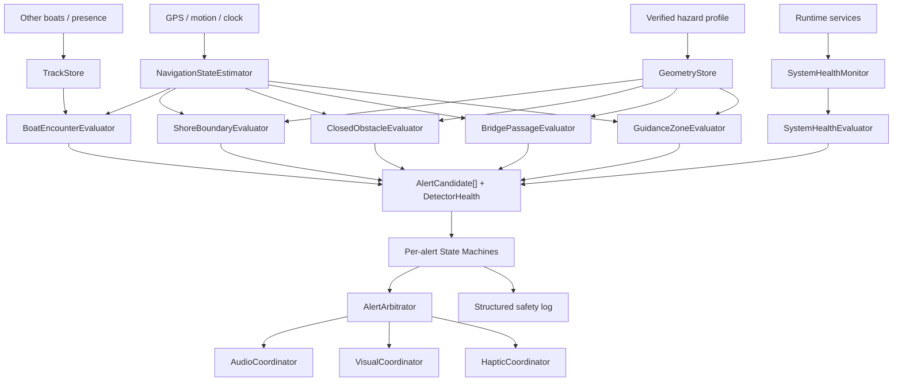

# 警告システム包括再設計

- 作成日: 2026-07-14
- 対象: `rowing-navigator-tsukuba` の全警告ロジック
- 状態: 外部レビュー・実装前シミュレーション・連続衝突判定を反映済みの短期公開用マスター設計
- 公開方針: 単一リリース候補へ統合し、一括テストで合否判定
- 詳細仕様: [他艇接近アラート再設計](./2026-07-14_他艇接近アラート再設計.md)
- 必須補強仕様: [警告システム実装前シミュレーション・補強仕様](./2026-07-15_警告システム実装前シミュレーション・補強仕様.md)
- 共有危険区域仕様: [共有危険区域・固定流木更新仕様](./2026-07-16_共有危険区域・固定流木更新仕様.md)
- 2026-07-16運用変更: コーチから艇へのクイックシグナル機能は削除し、指示はトランシーバーへ一本化する。艇一覧・航跡・異常検知等の監視機能は継続する

## 0. この文書の役割

本書は、他艇接近だけでなく、次の警告を一つの安全システムとして再設計する上位文書である。

- 他艇接近・交差・追越し
- 岸への接近
- 島・流木・一般障害物・一時障害物への接近
- 橋への接近と橋脚衝突
- カーブ進入
- 逆走注意区域への進入と、将来の実逆走判定
- GPS品質低下・位置喪失
- 位置共有停止・通信障害
- 危険区域データ・音声・検出器の異常
- コーチ画面の停止・水域外・艇ロスト・低電池

既存の他艇接近文書は破棄せず、`BoatEncounterEvaluator` の詳細仕様として本書の下に置く。実装時に両文書の記述が衝突した場合は、共通アーキテクチャとフェイルセーフ方針は本書、他艇固有の運動計算は他艇接近文書を優先する。

2026-07-15の実装前シミュレーションで、非同期順序、GPS喪失中の物理危険、通信session、対応水域、UIの誤安心に追加仕様が必要と判明した。実装時は必須補強仕様を併読し、本書と競合する箇所は新しい補強仕様を優先する。

本書は設計の固定化ではない。初期閾値は仮説として記録する。ただし公開を急ぐため、長期間の段階的PoCは前提にしない。公開必須範囲を一つのリリース候補へ実装し、自動・複数実機・実地シナリオをまとめた一括テストで合否判定する。後述する安全不変条件は、納期や閾値調整を理由に崩してはならない。

## 1. 結論

現行実装を部分修正だけで延命するのではなく、警告生成を次の4層へ分解する。

1. **状態推定**: GPS、時刻、方位、速度、位置共有データから、品質付きの現在状態を作る
2. **独立した検出器**: 他艇、岸、閉鎖障害物、橋、案内区域、システム異常などを個別に評価する
3. **警告状態管理**: 各警告を開始・継続・解除し、GPS揺れによる断続を防ぐ
4. **提示調停**: 複数警告を保持したまま、いま鳴らす音・表示・振動を一元決定する

画面上の「注意・警告・危険」という抽象的な段階分けを、利用者へ強制しない。利用者が知りたいのは「何が起きているか」「何を確認すべきか」「システムは信用できる状態か」である。

一方、内部では優先順位を廃止しない。優先順位がなければ、カーブ案内が目前の衝突音を止めたり、GPS障害の音が岸衝突警告を奪ったりする。外向きのレベル表示と、内部の調停優先度を分離する。

### 1.1. 最重要の改革

- `RiskAssessment` が単一の `level` と `primaryThreat` だけを返す構造を廃止し、複数の `AlertCandidate` を返す
- 「判定不能」を `safe` に変換しない。検出器の健全性を警告候補とは別に必ず返す
- GPSは合否だけで捨てず、`good / degraded / unusable` と理由、連続棄却、最終信頼位置を管理する
- すべての警告へ個別の状態機械、開始確認、解除確認、ヒステリシスを持たせる
- 警告音は録音ファイルだけを用い、アクションが必要な条件中は途切れずループさせる
- カーブ・逆走注意は実機の聞き逃し対策として区域内ループとし、その他の一回案内と分ける
- 橋を単なる「最大レベルを抑えた障害物」にせず、通航案内と橋脚衝突を分離する
- 位置共有停止、危険区域データ未読込、音声再生不能なども安全能力の喪失として扱う
- 警告形状と利用者の感度設定を分離し、艇ごと・端末ごとに危険区域形状が変わらないようにする
- コーチ監視の `lastSeen` をローカル受信時刻ではなく、艇が送信したサーバー時刻で判定する

## 2. 安全不変条件

実装方式や閾値を変えても、次を常に満たす。

1. **不明は安全ではない**  
   必須データが無い、古い、検出器が例外終了した場合、`safe` を返さない。

2. **一つの失敗が他を消さない**  
   ある障害物の不正データや検出器例外によって、他艇や岸の評価を中断しない。

3. **アクション警告は条件中に勝手に止まらない**  
   再生失敗を除き、解除確認が成立するまで録音音声をループする。

4. **瞬間的なGPS揺れで状態を往復しない**  
   開始・解除に異なる条件と時間を使う。

5. **重大な警告が軽い案内に負けない**  
   音声チャネルは一つでも、全警告の状態は保持し続ける。

6. **警告不能を利用者へ隠さない**  
   GPS、共有、危険区域、音声などの安全機能が使えない場合、継続表示する。

7. **同一条件を毎周期、新規警告として再生しない**  
   警告の識別子と状態を維持し、同じ音声を先頭から再開し続けない。

8. **安全判定は全必須検出器の健全性を含む**  
   `safe = no active action alert AND all required detectors healthy` とする。

9. **計測と設定変更で安全境界を無言で変えない**  
   危険区域バージョンと設定値を記録し、起動時に確認可能にする。

10. **アプリは見張りの代替を名乗らない**  
    警告は後方確認を促す補助であり、見張りを省略させるUI文言にしない。

11. **予測終点の安全を、予測区間の安全とみなさない**  
    物理警告は現在から予測終点までの連続したswept domainを評価し、区間途中の危険を飛び越さない。詳細は必須補強仕様§S25・§5.7に従う。

## 3. 現行実装の診断

### 3.1. 良い土台

現行には維持すべき点もある。

- 位置の古さ、精度、異常速度を除外する `GpsPositionFilter` がある
- 静的障害物と他艇の将来位置を一定間隔で評価している
- 音声プレイヤーはループモードを持ち、同一ファイル指定時は再起動しない
- 危険物ごとに既存の録音音声を割り当てられる
- 他艇位置には一定の鮮度除外がある
- 旧アプリ由来の基準線から危険区域を再生成する仕組みがある
- 航行停止時には共有データを削除する処理がある

再設計ではこれらを捨てず、責務を明確化して利用する。

### 3.2. P0: 運用前に解消または確認すべき問題

#### A. 単一レベル・単一対象への圧縮

`collision_risk_evaluator_service.dart` は、静的障害物と他艇を一つの `CollisionRiskLevel` と `primaryThreat` へ圧縮する。同レベルなら最初に見つかった対象が残り、配列順で主対象が変わり得る。確定障害物を先に返す経路は、まだ評価していない他艇を隠す可能性がある。

#### B. GPS不明が安全へ落ちる経路

自艇位置が無い場合に `lv0` を返す経路がある。画面側の別表示に依存せず、評価結果自体が `unknown` を表現できなければならない。

#### C. 検出器・データ読込エラーがログだけ

GPSストリーム、動的艇、静的障害物、プリセット読込のエラーに、`print` だけで終わる経路がある。利用者は警告能力が低下したことを知らない。

#### D. 旧アプリと現行の危険区域幅の差が未検証

旧Swift実装の初期幅は、岸、橋、島、流木で種類ごとに異なる。一方、現行の端末設定は同じ初期値を持つ。生成方式や現在の追加近接層との関係があるため単純移植は危険だが、現地図上比較と実艇確認なしに現行幅を正しいとみなせない。

#### E. 端末ごとに危険区域形状が変わる

`DangerZoneSettings` が端末ローカルに保存され、一般設定画面から形状そのものを変更できる。二つの艇が同じ位置でも異なる警告を受ける状態を作り得る。

#### F. 練習水域データが未確定

プリセットデータ内の練習水域は「要位置調整」と明記されている。このままコーチ側の水域外警告を本運用の安全通知にしてはならない。

#### G. 音声再生の実効監視がない

「警告は active だが、OS・音声フォーカス・プレイヤー異常で再生されていない」を自動復旧する監視がない。

### 3.3. P1: 抜本再設計で解消する問題

- 橋、岸、流木、カーブ、逆走注意の意味が同じ衝突レベルへ混在している
- 静的障害物の近接判定が最初に見つかった要素へ依存する
- カーブ・逆走注意は「区域内」のみで、進入・退出・進行方向の意味がない
- 橋の危険度を上限で抑えるだけで、橋脚と通航口を区別できない
- GPS精度を受理／棄却の二値にし、精度の悪化理由や継続時間を保持しない
- 受理後の不確実性を小さく上限固定し、高い `accuracy` を過小評価し得る
- 低速時の端末コンパスを移動方向として使う。端末の向きと艇の運動方向は同じではない
- 位置共有停止はカード表示だけで、航行警告との共通調停に入らない
- 一時障害物に期限、確認時刻、情報源、形状精度がない
- コーチ側の艇ロスト判定が、他艇更新によるスナップショット受信で遅れる可能性がある
- 水域外は生の点内外判定で、GPS誤差・滞在時間・復帰余裕を持たない
- 毎回の送信で電池残量APIを読むなど、キャッシュできる処理がある
- 全障害物を同じ赤色で描き、案内区域と立入危険を視覚区別できない
- `testZone` が通常の危険物種別と同じ経路にあり、本番データ混入時の隔離規則がない

## 4. 警告の新しい分類

「注意・警告・危険」という一軸ではなく、**振る舞い**、**内部優先度**、**データ品質**を別々に持つ。

### 4.1. 利用者に意味のある振る舞い

| 振る舞い | 意味 | 音声規則 | 例 |
|---|---|---|---|
| `continuousAction` | 直ちに確認・回避が必要 | 解除確認までループ | 他艇衝突、岸、橋脚、流木 |
| `entryEvent` | 区域への進入を一度知らせる | 1回再生、退出後再武装 | カーブ、逆走注意区域 |
| `persistentSystemFault` | 安全機能が低下・停止 | 状態に応じて継続または定期再通知 | GPS喪失、共有停止、区域データ異常 |
| `coachStatus` | コーチが確認する運用異常 | 新規時に通知、継続表示 | 艇ロスト、水域外、長時間停止 |
| `information` | 行動を急がせない情報 | 原則として音声なし | 設定同期、更新情報 |

### 4.2. 内部優先度

数値の大小は利用者に表示せず、調停器だけが使う。

| 優先帯 | 内容 | 例 |
|---|---|---|
| P0 | 行動期限が最短の衝突 | 数秒後の他艇・岸・橋脚衝突 |
| P1 | 明確な航行上の危険 | 閉鎖障害物への接近、危険な橋進入 |
| P2 | 安全能力の喪失 | GPS使用不能、共有停止、区域データ利用不能 |
| P3 | 航行案内 | カーブ進入、逆走注意区域進入 |
| P4 | 運用情報 | 低電池、設定状態 |

P0/P1の間では固定カテゴリ順ではなく、**推定行動期限**、衝突確度、解除不能時間、対象ロックで決める。

### 4.3. データ品質

警告自体の有無と、根拠データの品質を分ける。

```text
good      判定へ必要なデータが揃い、誤差が許容範囲
degraded  判定可能だが、予測時間や確信度を縮小すべき
unusable  安全判定を出せない。システム異常警告が必要
```

`degraded` は「危険度を上げる」だけではない。長期予測を信用せず、短い予測と大きい不確実性、早めの後方確認へ切り替える。

## 5. 目標アーキテクチャ



### 5.1. 責務境界

#### `NavigationStateEstimator`

- 生GPSを時系列整合性、精度、速度、コース精度で評価
- 最終信頼位置と現在推定位置を区別
- `PositionEstimate` と `GpsHealth` を生成
- 低速時に無理な進行方向を作らない
- センサー融合を追加しても、検出器のAPIを変えない

#### 各 `Evaluator`

- 自分の対象だけを評価
- 複数候補を返す
- 候補ごとの理由と品質を返す
- 異常を握り潰さず `DetectorHealth` を返す
- 音声を直接鳴らさない
- 他検出器の状態を直接変更しない

#### `AlertStateMachine`

- `alertId` ごとに状態を保持
- 開始デバウンス、解除デバウンス、ヒステリシス、再武装を適用
- 1回の安全判定で継続中の警告を消さない
- データが一時喪失した場合の保持方針を適用

#### `AlertArbitrator`

- 全警告を保持したまま、提示順位を決める
- 音声を鳴らす一件と、同時表示する複数件を決める
- 同一対象の音声再起動を防ぐ
- より行動期限が短い対象への切替を管理する

#### `AudioCoordinator`

- 録音音声だけを再生
- ループ、1回再生、定期再通知を振る舞いごとに制御
- activeなのに再生停止した場合を検知し復旧
- OS音声割込後の復帰を行う
- 再生失敗をシステム健全性へ返す

## 6. 共通データモデル

実装言語に合わせて調整してよいが、意味は次を保持する。

```dart
enum AlertBehavior {
  continuousAction,
  entryEvent,
  persistentSystemFault,
  coachStatus,
  information,
}

enum DataQuality { good, degraded, unusable }

class AlertCandidate {
  String alertId;           // detector + category + targetの安定ID
  String detectorId;
  String category;
  String? targetId;
  AlertBehavior behavior;
  int internalPriority;
  Duration? actionDeadline;
  double confidence;        // 危険度と混同しない
  DataQuality dataQuality;
  double? distanceMeters;
  DateTime evaluatedAt;
  List<String> reasonCodes;
  String audioAsset;
  VisualMessage visual;
  ClearPolicy clearPolicy;
}

class DetectorHealth {
  String detectorId;
  DataQuality quality;
  DateTime lastSuccessAt;
  List<String> reasonCodes;
}
```

`alertId` は表示文言や音声ファイル名から作らない。同じ他艇、同じ障害物、同じGPS障害を周期間で追跡できる安定IDにする。

### 6.1. 状態表現

```text
candidate -> active -> clearing -> cleared
                |          |
                +-> lost <-+
```

- `candidate`: 開始確認中
- `active`: 提示対象
- `clearing`: 解除確認中。音声は原則継続
- `lost`: active中に根拠データを一時喪失。即安全にしない
- `cleared`: 解除済み。再武装条件を待つものもある

`lost` は無期限に保持しない。古い根拠の個別警告を鳴らし続けることも、即座に安全扱いすることも避け、次の順で移行する。

1. 短い猶予中は、直前の個別警告を維持し、画面に「データ更新停止」を併記する
2. 猶予超過後は個別警告の音声ループを止め、GPSまたは対象データ喪失のシステム警告へ切り替える
3. 直前の対象・位置・接近状態は「最後に確認した危険」として画面に残す
4. データ回復時は新しい観測で再評価し、古い状態へ無条件復帰しない

初期猶予は一律固定せず、自己GPS喪失は5秒、他艇track喪失は「直前の行動期限と不確実性から算出し上限10秒」を候補とする。静的障害物データ自体は航行開始前に固定されるため、航行中の`lost`は主に自己GPS喪失として扱う。この値は一括リプレイ試験で確定する。

## 7. GPS・位置完全性の再設計

GPS誤差対策は、単に精度25m以上を捨てるだけでは足りない。スマートフォンの `accuracy` は真値を保証する境界ではなく、Androidでは68%程度の水平誤差半径として定義される。桜川では橋、岸、樹木、反射によるマルチパスも想定する。

### 7.1. `GpsHealthMonitor`

各fixについて少なくとも次を記録する。

- 水平精度
- 速度と速度精度
- course/bearingとcourse精度
- 端末受信時の単調時刻
- GPS測位時刻
- 前回信頼fixからの距離、時間、暗黙速度
- 連続採用数、連続棄却数
- 棄却理由
- 最終信頼fixの経過時間
- OS位置サービスと権限状態

判定は次の3状態にする。

| 状態 | 例 | 利用方針 |
|---|---|---|
| `good` | 新鮮、精度良好、移動整合 | 通常予測 |
| `degraded` | 精度悪化、course不確実、単発棄却 | 予測時間短縮、不確実性拡大 |
| `unusable` | 長時間更新なし、連続棄却、権限喪失 | 安全判定停止、GPS異常警告 |

閾値は現地ログで決めるが、最初から一つの固定値へ押し込めない。

### 7.2. `PositionEstimate`

```dart
class PositionEstimate {
  LatLng position;
  Vector2? velocity;
  double horizontalUncertaintyMeters;
  double? velocityUncertaintyMps;
  double? courseUncertaintyDegrees;
  DateTime measuredAt;
  Duration age;
  DataQuality quality;
  List<String> reasonCodes;
}
```

状態推定上の不確実性はGPS精度、経過時間、速度精度、旋回、連続棄却から増やし、小さい固定値で真の不確実性を隠さない。ただし、この値全量を警告ポリゴンの幅へ変換しない。幾何判定へ入れるGPS補助帯は排他領域に対する小さな上限付き成分とし、上限を超える不確実性は予測窓短縮、`degraded/unusable`、警告holdで扱う。障害物側にも `geometryUncertaintyMeters` を持たせるが、旧区域へ埋め込み済みの余裕と二重加算しない。

### 7.3. 方位の使用

- 移動予測には、精度条件を満たすGPSのcourse over groundを優先する
- 端末コンパスは端末の向きであり、艇の運動方向として直接使わない
- ローイングでは艇の進行方向と漕手の身体・画面方向が逆になるが、物理予測は実際の移動ベクトルで行う
- 低速・停止時は方向を `unknown` とし、方向非依存の排他領域で近接を評価する。GPS精度全量で巨大な円へ広げない
- 低速で無理に直線外挿しない

### 7.4. 時刻

- 端末内のfix順序と経過時間には単調時計を使う
- 共有データにはFirebaseのサーバー時刻を使う
- 端末時計のずれを検出し、相手艇の鮮度を端末時刻だけで決めない
- 時刻逆行、未来時刻、過大な遅延は品質理由として記録する

### 7.5. 連続棄却時の挙動

現行の「棄却して前回画面を維持」だけでは、警告が古い状態で凍る。

1. 単発棄却: 最終信頼状態を短時間保持し、品質を `degraded` にする
2. 連続棄却: 不確実性を時間とともに拡大し、長期予測を停止する
3. 許容時間超過: `unusable` とし、GPS異常を提示する
4. activeな衝突警告中の喪失: 即解除せず `lost` へ移す
5. 回復: 複数の整合fixを確認してから `good` へ戻す

### 7.6. 川中心線への吸着はしない

地図マッチングで艇を川中央へ強制すると、実際に岸へ寄った状態を隠し得る。中心線は次の補助だけに使う。

- 明らかな陸上ジャンプの疑いを示す
- 進行方向候補の妥当性を測る
- ログ解析で測位異常を分類する

安全判定の位置を無条件に書き換えない。

### 7.7. センサー融合

GPSと加速度の補完／Kalman filteringは、ローイング計測の速度・距離安定化に有望である。ただし、スマートフォンの設置向き、振動、消費電力、ドリフトがある。

- 公開初版ではGPS品質モデルだけを実装し、センサー融合は入れない
- 公開後、既存のストローク用センサー値を再利用できるか計測する
- IMUを絶対位置の根拠にはしない
- 公開後のオフライン比較で改善が確認できた端末だけ有効化する

## 8. 共通の開始・継続・解除規則

### 8.1. 行動警告

初期方針:

- 開始: 2回連続成立、または即時危険なら1回で開始
- 継続: 危険条件中は録音音声を連続ループ
- 解除: 安全側条件が3秒連続し、距離余裕と発散運動を確認
- active中のデータ一時喪失: 直ちに止めず `lost` 状態で短時間保持
- 再開始: 同一対象なら状態を引き継ぎ、音声を不要に頭出ししない

「2回」「3秒」は初期仮説であり、実ログで変更する。開始に慎重すぎて真陽性を遅らせないよう、短い行動期限は即時開始する。

### 8.2. カーブ・逆走注意の継続案内（2026-07-16改訂）

実機テスト結果を反映し、従来の「進入時に1回」は廃止する。

- カーブと逆走注意は、区域内で条件が続く間は音声をループ再生する
- 境界上の揺れは既存FSMの開始・解除確認で吸収する
- カーブと逆走注意が同時成立した場合、逆走注意を優先して直ちに音声を割り込む
- その他の同時警告は破棄せず、画面上に並行表示する

### 8.3. システム異常

システム異常は、性質で提示を変える。

- GPS使用不能: 航行安全判定ができないため、継続表示と音声／定期再通知
- 共有停止: 他艇から自艇が見えない。継続表示と定期再通知
- 危険区域データ不能: 静的危険を評価できない。継続表示し、航行開始を原則ブロック
- 音声不能: 音声で告知できないため、強い振動と全画面／固定表示
- 電池低下: 残量と予想運用時間に応じ、早期の非割込通知

P0/P1の衝突音が鳴っている間はシステム異常音が奪わない。ただし画面には同時表示する。衝突警告が解除されたら、未解消のシステム異常を音声提示する。

## 9. 警告調停と提示

### 9.1. 複数警告を捨てない

`AlertArbitrator` は、全active警告の配列を保持する。

- 画面上部: 現在もっとも行動期限が短い警告
- その下: 同時進行中の警告を最大2件程度、カテゴリと距離で表示
- システム健全性: 専用の固定インジケーター
- 地図: 対象を色、輪郭、アイコンで強調
- 音声: 一度に一つ

同時に複数の行動警告がactiveでも、公開初版では音声を短時間で交互再生しない。交互再生は最重要警告を途切れさせ、対象認識を不安定にするためである。

- 行動期限が最短の主警告を連続再生する
- 二件目以降は画面に同時表示し、新規発生時だけ短い振動を追加する
- 主警告より明確に行動期限が短くなった場合だけ音声対象を切り替える
- 複数危険専用音源は、艇上での識別試験を通った場合だけ将来追加する
- 二件目を含む全候補はログと地図から失わない

### 9.2. 主警告選択

固定の配列順ではなく、次の順で選ぶ。

1. 振る舞いが行動警告か
2. 行動期限が短いか
3. 衝突確度とデータ品質
4. 現在対象のロックを維持すべきか
5. 距離と接近速度

現在対象より明確に緊急な対象だけが割り込む。毎秒、二艇の主対象が入れ替わる音声チャタリングを防ぐ。

### 9.3. 音声

- TTSは使わない
- 既存の録音音声を再利用する
- 行動警告は条件中ループ
- 同じアセット・同じ対象の継続では `stop -> play` を行わない
- 対象切替でも同じ音声なら、必要性がなければ途切れさせない
- 1回案内は完了後に止め、区域内で繰り返さない
- activeな行動警告なのに1秒以上再生状態でなければ再試行する
- 再試行失敗時は振動と固定エラー表示へ切り替える

### 9.4. 画面

単に赤いバナーへ統一せず、意味を区別する。

| 種類 | 表示例 | 地図表現 |
|---|---|---|
| 他艇 | 「他艇接近・後方確認」 | 対象艇と予測帯を強調 |
| 岸 | 「岸接近・後方確認」+ 距離・接近傾向 | 対象岸区間を強調 |
| 閉鎖障害物 | 「流木接近」 | 障害物輪郭を強調 |
| 橋 | 「橋脚接近」または「通航口を確認」 | 橋脚と通航口を別表示 |
| 案内 | 「カーブ進入」 | 区域を案内色で表示 |
| システム | 「GPSで安全判定できません」 | 健全性帯を固定表示 |

文章は短くし、ボート上で一瞥して理解できる語にする。距離や秒数は品質が十分な場合だけ表示し、疑わしい精密値を出さない。

公開初版の音声では左右を言わない。「右岸／左岸」は河川基準、「右／左」は漕手の身体基準と艇首基準が混同し得るためである。将来左右を追加する場合は、進行方向である艇首を基準に `右舷側 / 左舷側` と表現し、部内で使う用語との対応確認とブラインド識別試験を完了してから収録する。

### 9.5. 振動

- 画面を見ていない状況の冗長経路として使う
- P0/P1の新規開始、音声失敗、重大システム障害に限定する
- 連続振動で操艇を妨げない
- OS・端末差を実機確認する

### 9.6. 航行中タッチ操作ゼロ

航行中の安全機能は確認タップ、既読、消音、overrideを要求しない。濡れた手、手袋、振動、画面非注視を前提にする。

- 航行前overrideは開始前だけ許可し、航行中に追加要求しない
- P0/P1行動警告の遠隔消音は公開初版へ入れない
- GPS等のP2システム異常は、状態を解除せず「再通知だけ確認済み」にする余地を残す
- 誤警告が固着した場合は、安全な場所で航行を停止してから管理者が原因を扱う

コーチからの遠隔消音は、通信遅延、対象取り違え、誤操作によって実危険を消すため採用しない。これはIMO機器のacknowledge概念を無視するのではなく、タッチ不能な小艇・単一音声チャネル・一般スマートフォンという本アプリの条件では、利益より新しい危険が大きいという判断である。

### 9.7. ホーム画面の管理導線

観察者モードでは、編集導線を次の名称と優先度で表示する。

- 危険区域の追加・共同編集・固定流木更新の入口は「障害物の追加」とする。旧表記の「水域図」は使わない
- 「設定」は「危険区域・警告設定」を直接開く。障害物編集画面を経由させない
- 開発用の「詳細」は最も視覚的優先度を下げ、安全操作や障害物編集ボタンより小さく表示する

## 10. 他艇接近

詳細は [他艇接近アラート再設計](./2026-07-14_他艇接近アラート再設計.md) を参照する。

共通設計へ接続する要点は次の通り。

- 固定30秒外挿ではなく、データ品質に応じた短い予測窓を使う
- 相対位置、相対速度、CPA/TCPA、船体領域、交差時刻を組み合わせる
- 同期した相対運動区間と双方の合成安全領域を連続評価し、最初の侵入時刻を求める
- 地理的な2本の延長線が交差するだけでは警告せず、時間差交差を除外する
- 「30秒先の点」ではなく、行動期限を返す
- stale targetを即削除せず、警告中なら短時間 `lost` として扱う
- 同一艇を安定IDで追跡し、主対象をロックする
- 端末時刻ではなくサーバー時刻とプレゼンスを使う
- 接近中・交差・追越し・並走・離反を区別する
- 他艇警告は静的障害物と同じループで早期returnさせない

## 11. 岸接近

岸は「ポリゴンに入ったか」だけでは不十分である。川沿いの長い境界へ、どちら向きに、どの速度で寄っているかが重要になる。

### 11.1. 判定

`ShoreBoundaryEvaluator` は次を使う。

- 最寄りの岸基準線区間
- 岸までの符号付き横距離
- 岸方向の速度成分
- 自艇の船体長・幅を含むswept domain
- GPS不確実性と岸形状の不確実性
- 現在位置と短期予測

swept domainは予測終点のポリゴンだけではなく、各予測区間で自艇領域が通過する面全体を意味する。現在と終点の間に岸があれば、終点が岸の外側でも侵入として扱う。

単なる「15m以内」ではなく、岸へ寄っている艇と岸から離れている艇を区別する。ただし既に非常に近い場合は、速度が離反でも一定時間警告を保持する。

岸の固定危険区域は、基準線の陸側へデフォルト15m広げる。これは陸地側に未判定領域を残さないための形状余裕であり、水上側で使う接近補助距離15mとは別の値である。したがって両者を加算して水上側の危険帯を30mにするものではない。

### 11.2. 開始と解除

- 開始: 安全余裕を含む距離侵入、または短い予測時間内の侵入
- 即時開始: 現在の船体領域が危険帯へ重なる
- 解除: 外側余裕まで離れ、岸方向速度が非接近の状態を連続確認
- 音声: 既存の岸警告ファイルをループ

### 11.3. データ整備

基準線から矩形を連ねる現行生成方式は、旧アプリの意味を保持したまま検証する。角部で楔状の隙間や重複ができないか、全区間を自動検査する。生成方式を変える場合は、旧版・現行版・新版を地図重畳して差分確認する。

## 12. 島・流木・一般障害物

これらは原則として「通過してよい案内区域」ではなく、閉鎖障害物として扱う。

固定流木の閉じた外周は、縁に沿った帯ではなく内側全体を塗りつぶした1個の閉鎖ポリゴンとして扱う。固定流木は消滅しない永続障害物であり、同梱基準形状を必ず保持した上で、位置・長さ・幅・向き・外側安全余裕を共同更新できる。保存・同期・権限の詳細は[共有危険区域・固定流木更新仕様](./2026-07-16_共有危険区域・固定流木更新仕様.md)に従う。

### 12.1. 共通判定

`ClosedObstacleEvaluator` が次を評価する。

- 現在の船体領域との重なり
- 速度ベクトルに沿う短期swept domain
- 形状までの最短距離
- 接近／離反
- GPSと形状の不確実性
- 障害物種別と個別音声

短期swept domainはゼロ幅の中心線ではなく、艇種別排他領域を基本幅とする。GPS補助帯の初期値は`accuracy × 0.25`を全幅へ一度だけ加え、静的危険では全幅2mを上限とする。旧余裕入り区域では補助帯を0mとする。直進区間は連続線分対拡張ポリゴン、旋回区間は向きを保ったpiecewise経路で評価し、離散点だけの判定や艇全長を半径とする巨大capsuleへ戻さない。

障害物ごとのポリゴン全走査ではなく、空間インデックスで候補を絞ってから精密計算する。

### 12.2. 同じ危険度でも個別音声

内部優先度が同じでも、利用者にとって対象の意味が違う。`audioAsset` はカテゴリ既定値に加え、障害物データの個別指定を許可する。

```text
個別指定 > 種別既定値 > 一般障害物音声
```

ファイル欠落時に無音へ落ちず、起動前検査で航行開始を止めるか、検証済みの一般音声へ明示的にフォールバックする。

## 13. 橋

橋は「通過する対象」として扱う。橋脚と通航口を分離する設計は現地測量が完了するまで公開初版へ含めない。当面は橋全体を単一の通過ゾーンとし、進入から退出まで音声を継続する。

### 13.1. 挙動

- 分類: `continuousAction`
- 開始: 橋接近ゾーンへ進入した時点、または即時ゾーン内で起動した場合
- 継続: ゾーン内にいる間、既存の `assets/audio/bridge_warning.mp3` を連続ループ
- 解除: ゾーンから退出し、外側余裕まで離れた状態を数秒連続確認
- 音声調停: 岸・他艇・流木などのP0/P1行動警告が同時activeで、行動期限が明確に短い場合はそちらへ音声を譲る。橋の状態と表示は保持し続ける
- 進行方向は判定しない: 橋の下で引き返した場合も「ゾーン退出」で解除する

「通過完了」を進行方向で判定するにはGPSのcourse品質と橋の通航方位データが必要であり、両方が揃うまでは「ゾーン退出=通過相当」として扱う。表示文言は「橋接近・通過中」とし、「安全通過中」のような判定を含む表現は使わない。

### 13.2. 必要なデータ

各橋について、公開初版は次だけを持つ。

```json
{
  "bridgeId": "...",
  "approachZone": ["...polygon..."],
  "geometryUncertaintyMeters": 0,
  "version": 1
}
```

`approachZone` は、橋本体を含み、進入前後の一定距離まで拡張したポリゴンとする。既存の橋ポリゴンへ安全余裕を加えて生成してよい。橋脚ごとの実形状、通航口の回廊、許容進行方位は本ファイルへ持たせない。

### 13.3. 現地確認後に切り替える目標設計

橋脚形状と通航口が現地測量で確定した時点で、§13.1〜§13.2の単一ゾーン設計を廃止し、以下の分離設計へ移行する。それまでは「橋の下では音を鳴らす」以上のことを保証しない。

#### 13.3.1. 橋脚・立入禁止形状

- 閉鎖障害物として行動警告
- 条件中は音声ループ
- 橋脚ごとの実形状または安全余裕付きポリゴンを持つ
- GPSマルチパスを考慮し、形状不確実性を設定する

#### 13.3.2. 通航口・進入案内

- 通過可能な回廊をデータとして持つ
- 回廊への進入角、横ずれ、進行方向を評価
- 正常進入なら必要な地点で1回案内
- 明確に橋脚方向へ外れる場合は行動警告へ昇格
- 通航口データが未検証なら、精密な「安全」表示は出さない

#### 13.3.3. 移行後のデータ形式

```json
{
  "bridgeId": "...",
  "piers": ["...polygon..."],
  "passageCorridors": ["...polygon..."],
  "allowedBearingRanges": ["..."],
  "geometryUncertaintyMeters": 0,
  "verifiedAt": "...",
  "version": 2
}
```

移行時は `version` を上げ、旧 `approachZone` は互換のため残しつつ、`piers` と `passageCorridors` が両方存在する橋については分離判定へ切り替える。片方だけ確定した橋は、確定した側だけを分離扱いにし、未確定側は `approachZone` 継続とする混在を許容する。

## 14. カーブと逆走注意

### 14.1. カーブ（2026-07-16改訂）

現在のデータだけでカーブの推奨回避方向は判定できないが、実機で聞き逃しがあったため、区域内でループする注意案内とする。

- 区域内で条件成立中は再生を継続する
- 逆走注意の成立時はカーブより逆走注意を優先する
- 解除は共通FSMの安全側連続確認に従う

将来、中心線、推奨進路、進入方位を整備できたら、横ずれや不適切な進入角を別警告にする。

### 14.2. 「逆走注意」と「実逆走」を分ける

現行ポリゴンは「逆走の可能性に注意する区域」であり、艇が本当に逆走しているかを示さない。画面文言と内部カテゴリを `reverseAwarenessZone` へ改める。

本当の逆走判定には次が必要である。

- 区域または区間ごとの許容進行方位
- 上下航レーンまたは中心線
- course精度と最低移動速度
- 方向が一定時間継続したこと
- 旋回・発艇・停止中を除外する状態

これらが揃うまで、「逆走しています」と断定しない。揃った後は `WrongWayEvaluator` が連続行動警告を生成する。

## 15. 一時障害物

Firestore等から取得する一時障害物は、期限なしの一般ポリゴンにしない。

一時障害物はログイン中の全利用者が、作成者に関係なく編集・削除できる。ただし編集で失効期限を延長してはならない。固定流木は本節の一時障害物に含めず、失効しない永続更新対象として§12および[共有危険区域・固定流木更新仕様](./2026-07-16_共有危険区域・固定流木更新仕様.md)に従う。

必須フィールド:

- `id`
- `kind`
- `geometry`
- `geometryUncertaintyMeters`
- `source`
- `createdAt`
- `updatedAt`
- `verifiedAt`
- `expiresAt`
- `status: active / resolved / unverified`
- `audioAsset` または種別
- `schemaVersion`

期限切れは評価対象から外すが、端末時計だけで決めずサーバー時刻を使う。未確認情報は、確定障害物と同じ断定表現にせず、管理者確認フローを持たせる。

### 15.1. テスト区域

`testZone` は本番危険区域から分離する。

- debug buildまたは明示的な訓練モードでのみ読込
- 本番プロファイルのschema検証では含有を拒否
- 地図と音声に「テスト」を明示
- テスト警告は実警告を抑止しない
- 訓練モードの開始・終了をログへ残す

## 16. システム健全性の警告

### 16.1. GPS

| 条件 | 振る舞い |
|---|---|
| 一時的品質低下 | 黄系の固定表示、予測短縮 |
| 連続棄却・stale | 「GPSで安全判定できません」+ 音声／振動 |
| 権限・位置サービスOFF | 航行開始ブロック、設定導線 |
| 回復 | 複数fix確認後に解除、短い回復表示 |

### 16.2. 位置共有

共有停止は「自分が他艇を見られるか」だけでなく、「他艇から自分が見えない」問題である。

- 初回送信成功を航行開始前に確認
- 一定回数の失敗で `degraded`
- 一定時間未送信で `unusable`
- activeな衝突警告より音声優先しない
- 状態中は固定表示し、定期的に再通知
- 接続回復だけで解除せず、実際の送信成功を確認

### 16.3. 危険区域データ

- JSON schema、バージョン、必須種別、座標妥当性を検証
- ポリゴンの点数、自己交差、NaN、緯度経度範囲を検査
- 基準線生成結果の隙間、極端な面積、左右反転を検査
- 読込失敗や全スキップを航行画面へ明示
- 最後に検証済みのデータへ戻す場合は、そのバージョンを表示

### 16.4. 動的艇ストリーム

- 認証状態、接続状態、最終正常受信時刻を管理
- ストリーム例外を艇ゼロ件と区別
- 受信不能時は「周辺艇なし」と表示しない
- 再購読とバックオフを行い、状態をログ化

### 16.5. 音声

- 起動時に全利用音声アセットの存在と再生準備を検査
- 航行開始前に利用者がテスト音を聞ける操作を設ける
- active中の再生状態を監視
- 音量ゼロ、Bluetooth経路、他アプリ割込など、アプリだけでは断定できない状態は確認UIを出す
- 音声不能時は振動と固定表示を最優先する

### 16.6. 権限・バックグラウンド・電池

- 必要権限とOS設定を航行開始前に確認
- 画面ロック時の位置更新・音声再生を実機で確認
- 低電力モードやバックグラウンド制限を検出できる範囲で案内
- 電池残量は30〜60秒キャッシュし、毎秒API取得しない
- 残量警告は衝突音へ割り込ませない

現行コードにはAndroidの位置foreground通知、iOSのlocation background modeと背景更新設定がある。ただし、安全パイプラインは`useNavigator`のhookとDart timerへ結び付いており、設定ファイルの存在だけでは画面ロック・画面遷移・OS suspend中の継続を保証しない。

### 16.7. 安全パイプラインwatchdog

`SystemHealthMonitor` は検出器だけでなく、状態推定から音声提示までの心拍を監視する。

- GPS受信心拍
- 評価tick心拍
- FSM更新心拍
- 調停更新心拍
- 音声プレイヤー状態心拍
- 位置共有成功心拍

各心拍へ期待周期と猶予を持たせ、欠落時に`SAFETY_PIPELINE_STALLED`を生成する。パイプラインの所有者は画面widgetから分離し、画面再構築や画面ロックだけでdisposeされない構造にする。

ただしアプリprocess自体がkillされた場合、アプリ内watchdogは動けない。Androidの継続通知、iOSの背景位置状態、サーバー上の艇heartbeat、コーチ側艇ロストを組み合わせる。標準の「5分ごとの正常音」は、正常を保証できず迷惑音と誤安心を生むため採用しない。画面には常時「警告は見張りの代替ではない」を短く表示する。

## 17. コーチ監視

コーチ側は艇上警告と利用者が異なるが、同じ状態・健全性の考え方を使う。

### 17.1. 艇ロスト

現行のスナップショット受信時刻を各艇の `lastSeen` にしない。Realtime Databaseの全体スナップショットは、別艇の更新でも配信され得る。

- 各艇が送信したサーバー時刻を使う
- `onDisconnect` とpresenceを併用
- `fresh / delayed / stale / offline` を区別
- activeな危険状態で途絶した艇は優先表示
- 最後の位置と時刻を地図に残す

### 17.2. 水域外

- 練習水域ポリゴンを現地確認するまで本運用判定を無効にする
- 境界にGPS不確実性とヒステリシス帯を設ける
- 短い逸脱ではなくdwell時間後に通知
- 明確に遠い逸脱は即時通知
- 復帰も内側余裕と一定時間で確定する

### 17.3. 長時間停止

停止は休憩、指導、待機でも発生するため、単独で危険と断定しない。

- 速度精度を考慮
- 練習中ステータス、予定、近傍艇、直前の異常を文脈に使う
- 初回はコーチ確認のstatus通知
- GPSロストや水域外と組み合わさる場合は優先度を上げる
- 再移動を一定時間確認して解除

### 17.4. 低電池

残量のアイコン表示だけでなく、予想残時間と共有停止リスクとして通知する。ただし、閾値は端末差が大きいため、運用ログから決める。

## 18. 危険区域・設定のガバナンス

### 18.1. 形状と感度を分ける

一般利用者が変更できるもの:

- 許容範囲内の予測感度
- 案内音の有効／無効。ただし重大安全警告は無効化不可
- 音量確認

管理者だけが変更できるもの:

- 岸・橋・障害物の形状
- 種別
- 個別音声
- 検証日とデータソース
- 安全余裕の基準値

### 18.2. バージョン管理

危険区域プロファイルへ次を持たせる。

- schema version
- content version
- checksumまたは署名
- 作成者・検証者
- 作成日・現地確認日
- 対象コース
- 互換アプリバージョン

起動時とログにバージョンを残し、コーチ側から各艇の使用バージョンを確認できるようにする。

公開初版は配布方式を単純化し、検証済み危険区域プロファイルをアプリへ同梱して不変とする。航行開始時のネットワーク取得やリモート差替えは行わない。

- アプリversionと危険区域content versionを対応付ける
- 起動時に同梱ファイルのchecksumを検証する
- コーチ画面で各艇のアプリ／プロファイルversionを確認する
- 同一セッション内でversionが混在した場合は出艇前に警告する
- 期限・情報源・検証状態を実装できない間は、リモート一時障害物を公開版で無効化する

これによりオフラインキャッシュ、途中更新、端末間混在の問題を公開初版から切り離す。リモート配信は署名・ロールバック・混在検知まで揃ってから追加する。

### 18.3. 旧アプリとの比較

旧アプリの生成意味を尊重し、完成ポリゴンだけをコピーしない。また、現行側に別の近接余裕がある場合は二重加算しない。

比較手順:

1. 同じ基準線から旧設定・現行設定・候補設定を生成
2. 地図上で重畳
3. 差分面積、最短距離、角部隙間を自動出力
4. 橋・岸・島・流木ごとに確認
5. 実艇ログを重ねる
6. 管理者が検証版として固定

## 19. 録音音声の運用

### 19.1. 既存音声

旧アプリまたは現行にある岸、橋、島、流木、カーブ、逆走注意、他艇、テスト音声を優先的に再利用する。ファイルはライセンスと内容を確認し、Flutterのアセットへ登録する。

現時点でFlutter側に登録済みの対応は次の通りである。

| 対象 | 現在のアセット |
|---|---|
| 他艇・一般 | `assets/audio/add_warning.mp3` |
| 岸 | `assets/audio/shore_warning.mp3` |
| 橋 | `assets/audio/bridge_warning.mp3` |
| 島 | `assets/audio/island_warning.mp3` |
| 流木 | `assets/audio/driftwood_warning.mp3` |
| カーブ | `assets/audio/curve_warning.mp3` |
| 逆走注意 | `assets/audio/reverse_warning.mp3` |
| テスト | `assets/audio/test_warning.mp3` |

この対応はコードとファイルの存在確認であり、音声内容が名称どおりか、艇上で聞き取れるかまでは保証しない。実装切替前に試聴する。

### 19.2. 追加候補

システム異常も音声化する場合、次のファイル名を推奨する。

```text
assets/audio/gps_unavailable_warning.mp3
assets/audio/position_sharing_warning.mp3
assets/audio/hazard_data_unavailable_warning.mp3
```

音声再生機能自身の故障は音声で知らせられないため、専用ファイルは作らず振動・表示で扱う。

### 19.3. 音声マニフェスト

```json
{
  "id": "shore_warning",
  "asset": "assets/audio/shore_warning.mp3",
  "behavior": "continuousAction",
  "sha256": "...",
  "durationMs": 0,
  "loudnessTarget": "...",
  "version": 1
}
```

- 音量、ピーク、無音部、ループ継ぎ目を統一
- 短すぎる音は不快な高速反復にならない間隔を音源側またはプレイヤー側で設ける
- ファイル更新時はversion/checksumを変更
- 全アセットをCIと起動前検査で照合

### 19.4. 手動で必要になる作業

実装段階で利用者側にお願いする可能性がある作業は次の通り。現時点ではまだ不要である。

1. 旧アプリ音声の内容を試聴し、用途との対応を最終確認する
2. 上記3種類のシステム音声を採用する場合は録音・音量調整する
3. 実機で、艇上の騒音下でも聞き取れる音量か確認する
4. Bluetooth利用時と端末スピーカー時の出力先を確認する
5. 音声名を伏せて順不同に再生し、対象を正しく言い当てられるか確認する

ファイル探索とFlutterへの登録自体は実装作業で対応可能であり、利用者が手でコピーすることを前提にしない。

## 20. 性能・電池

スマートフォンで十分軽い計算を選び、必要以上に全機能を高頻度実行しない。

### 20.1. 更新周期

| 処理 | 初期周期 | 備考 |
|---|---:|---|
| GPS品質 | fixごと、監視1Hz | 位置更新と同時 |
| 他艇・硬い障害物 | 1Hz | 危険近傍のみ必要に応じ高頻度 |
| 空間候補抽出 | 1Hz | インデックス利用 |
| システム健全性 | 1Hz | 重いAPIはキャッシュ |
| コーチ異常 | 5秒 | 現行相当 |
| 電池残量 | 30〜60秒 | 毎送信で読まない |
| ログ書出し | バッファ処理 | 警告判定をブロックしない |

### 20.2. 負荷を抑える方法

- 緯度経度を毎候補で重く変換せず、近傍の局所座標を再利用
- 起動時に局所ENU平面と各形状のAABBを一度計算し、全検出器で共有
- 公開初版はAABB候補抽出+総当たりで実測し、p95が基準内ならR-treeを入れない
- R-treeまたはgrid indexは、実測で必要になった場合だけ追加
- 粗い包絡矩形・距離で候補抽出してからポリゴン計算
- 未来形状を全艇・全秒・常時描画しない
- 地図描画と安全判定のデータを共有するが、描画失敗を判定へ波及させない
- GPSが静止中でも安全に必要な最小更新を維持
- センサー融合の常時高周波化はプロファイル後に判断

### 20.3. 受入基準

代表的な下位性能端末で次を測る。

- 警告判定のp95時間
- 1時間航行時の電池消費
- 発熱とOS throttling
- 他艇数・障害物数増加時の遅延
- 画面ロック／バックグラウンドでの更新継続

性能閾値は端末選定後に数値化する。計算負荷より、GPS常時測位・画面・通信の方が支配的になりやすいため、推測でアルゴリズム精度を落とさず実測する。

## 21. セキュリティ・プライバシー

- Realtime Databaseは認証を必須にし、艇IDと書込権限を検証
- `.validate` で座標、時刻、速度、スキーマを制約
- 他艇IDのなりすまし書込を防ぐ
- `onDisconnect` でpresenceを更新
- 位置履歴は必要最小限の保持期間にする
- 安全ログの利用目的とアクセス範囲を定める
- 危険区域の種類ごとに権限を分離する。臨時危険区域はログイン中の全利用者が共同編集・削除可、固定流木は共同更新可・削除不可、その他の固定プリセットはアプリ内編集不可とする
- 期限切れ・改ざん・互換性不一致の危険区域を拒否する

セキュリティ異常を単なる通信エラーへ丸めず、認証失敗、権限拒否、ネットワーク切断を理由コードで区別する。

## 22. 観測可能性と安全ログ

「鳴った／鳴らなかった」の再現に必要な情報を、個人情報を抑えながら構造化する。

### 22.1. 記録するイベント

- GPS quality遷移と理由
- fix採用／棄却理由
- 検出器の候補生成と健全性
- 警告状態遷移
- 主警告切替と理由
- 音声開始・継続・停止・再試行・失敗
- 位置共有成功／失敗／回復
- 使用中の危険区域バージョン
- アプリ状態、OS状態、電池状態

### 22.2. 記録しない／抑えるもの

- 不要な長期位置履歴
- 音声内容そのもの
- 認証トークン
- 利用目的のない端末固有情報

### 22.3. 理由コード

表示文言ではなく、安定したコードを残す。

```text
GPS_STALE
GPS_ACCURACY_DEGRADED
GPS_CONSECUTIVE_REJECTS
TARGET_DATA_STALE
SHORE_DOMAIN_INTERSECTION
BRIDGE_PIER_APPROACH
ALERT_CLEAR_HYSTERESIS
AUDIO_PLAYBACK_STOPPED
HAZARD_PROFILE_INVALID
```

## 23. テスト戦略

### 23.1. 安全不変条件テスト

- 検出器例外が `safe` にならない
- 一つの不正障害物が他候補を消さない
- activeな行動警告は一瞬のsafeで止まらない
- 軽い案内が重大音声を停止しない
- 同一警告の毎周期再生がない
- GPS喪失中に「周辺安全」と表示しない
- 新規のより重大な警告が1評価周期以内に提示される
- 音声停止をwatchdogが検出する

### 23.2. GPSテスト

- 定常バイアス
- 境界付近のランダム揺れ
- 橋下のマルチパス
- 数十mの瞬間ジャンプ
- 位置停止と時刻だけ進行
- 時刻逆行・未来時刻
- 精度値悪化
- courseのみ異常
- 速度精度不良
- 連続棄却後の回復
- active警告中の位置喪失

### 23.3. 形状テスト

- 自己交差ポリゴン
- 点不足、重複点、NaN
- 基準線の逆順
- 隣接矩形の角部隙間
- 左右距離の取り違え
- 極端な面積
- audioAsset欠落
- schema/version/checksum不一致
- 期限切れ一時障害物

### 23.4. カテゴリ別シナリオ

- 岸へ接近／平行／離反
- 島の横を平行通過
- 流木への直進
- 橋通航口への正常進入
- 橋脚方向へ逸脱
- カーブ境界をGPS揺れで往復
- 逆走注意区域を正常方向で通過
- 実逆走メタデータが無い状態
- 二艇以上の同時接近
- 他艇と岸の同時警告
- 衝突中にGPSが失われる
- 衝突中に共有が止まる
- 音声中に電話・Bluetooth切替が入る

### 23.5. 決定論的リプレイ

実航行ログを匿名化し、同じ入力に同じ警告列を返すリプレイテストを作る。旧・現行・新ロジックを同じログへかけ、開始時刻、解除時刻、誤警告、見逃し、音声中断数を比較する。

### 23.6. property/fuzz/fault injection

- 入力順を変えても、重大候補集合が変わらない
- 形状配列へ不正要素を混ぜても、正常要素の評価が続く
- 通信・音声・データ読込を任意時点で失敗させる
- 候補数を増やして処理時間上限を検証
- 状態機械の任意列で二重開始・解除漏れが起きない

### 23.7. 一括リリース候補テスト

長期PoCの代わりに、一つのrelease candidateを次の順で一括判定する。危険な実艇接近を再現するのではなく、自動リプレイと陸上端末移動で限界条件を作り、実艇では十分な安全距離を確保して最終確認する。

#### A. 自動試験

- `dart analyze`
- `flutter test`
- Android release build
- iOS release buildまたはarchive検証
- 危険区域schema/checksum/形状検証
- production buildが`testZone`を拒否し、一般利用者が危険区域形状を変更できないことの検証
- 録音音声マニフェストとアセット存在検証
- GPS揺れ、stale、jump、時刻逆行の決定論的リプレイ
- 全カテゴリと複数同時警告のシナリオ試験
- 通信・検出器・音声失敗のfault injection

#### B. 二台以上の実機統合試験

- 航行前チェックから停止・共有削除まで通す
- 画面ON、画面ロック、バックグラウンドを連続実行する
- 他艇接近を安全な陸上移動または位置リプレイで再現する
- active警告中にGPS OFF、通信断、相手データ停止を発生させる
- Bluetooth接続／切断、別音声割込、音量状態を確認する
- process kill時にコーチ側で艇ロストになることを確認する
- 同一プロファイルversionが両端末に表示されることを確認する
- AndroidとiOSの公開対象実機をそれぞれ最低一台含める

#### C. 一回の統合実地試験

- 岸、島、橋、カーブ等を安全余裕の外側から通過する
- GPS境界揺れ、橋周辺の品質低下、通常離反で誤ループしないことを確認する
- 二艇は衝突コースを作らず、十分な離隔と安全要員を置いて接近・交差・追越し相当を確認する
- 艇上騒音下で全音源をブラインド識別する
- 漕手へ航行中のタッチ操作を要求しないことを確認する
- ログから警告開始、継続、解除、主対象切替をその場で照合する

#### D. 合格基準

- 必須シナリオの行動警告見逃し: 0件
- 検出器・データ異常が`safe`表示になった件数: 0件
- GPS揺れによる音声停止・再起動: 0件
- 条件継続中の意図しない音声停止: 0件
- 警告開始遅延p95: 1評価周期+1秒以内
- 音声watchdogによる復旧: 停止検出後2秒以内
- 主対象の不要な切替: 10秒間に1回以下。ただし明確に短い行動期限の新規対象は除く
- 画面ロック／バックグラウンド中の無告知パイプライン停止: 0件
- crash、ANR、未処理例外: 0件
- `flutter test`、release build、危険区域・音声検証: 成功
- `dart analyze`: error 0、warning 0。既存infoは一覧を固定し、安全関連の変更箇所で新規infoを増やさない

誤警告率の「1件/艇・時間」は短い一回の試験だけでは統計的に保証できないため、公開ゲートの断定値には使わない。代わりに、危険なしリプレイと実地の全安全通過で行動警告0件を要求し、公開後も匿名化した件数指標を継続監視する。

## 24. 単一リリース候補への集約

段階的な一般公開や長期間のPoCは行わない。ただし、大規模変更を一度に書いて最後に初めて動かすこともしない。以下は同じrelease candidate内の**実装依存順**であり、各作業単位で自動試験を通し、最終的な公開可否だけを§23.7の一括試験で決める。

### Work package 0: 可観測化と公開阻止条件

- 理由コード、GPS棄却、音声実再生、パイプライン心拍
- 危険区域version/checksum
- production feature flag
- 失敗を`safe`へ変換しない共通結果型

### Work package 1: 公開必須の共通基盤

- `PositionEstimate`と`GpsHealthMonitor`
- 複数`AlertCandidate`と`DetectorHealth`
- 警告ごとのFSM、lost上限、ヒステリシス
- `AlertArbitrator`、音声ループ、audio watchdog
- GPS、共有、危険区域、pipeline停止の利用者表示
- 航行中タッチ操作ゼロ

### Work package 2: 公開必須の警告カテゴリ

- 他艇を静的障害物の早期returnから分離
- 岸、島、流木、一般障害物の継続行動警告
- カーブ／逆走注意を一回の進入案内に変更
- 橋は§13の approachZone を用い、進入から退出まで `bridge_warning.mp3` を継続ループ。橋脚と通航口の分離、通航方位判定は現地測量完了まで公開初版へ入れない
- 録音音声だけを使用

### Work package 3: 配布・ライフサイクル

- 安全パイプラインを画面hookの寿命から分離
- Android foreground locationとiOS background locationを実機確認
- 同梱危険区域プロファイルを固定し、version混在を出艇前表示
- process killをコーチ側heartbeatで検知
- production signing、権限説明、プライバシー表示を整える

### 公開初版で無効化または延期する機能

| 機能 | 公開初版の扱い | 理由 |
|---|---|---|
| 真の逆走判定 | 無効 | 許容方位・レーンデータがない |
| 橋脚／通航回廊判定 | 延期。橋全体を単一の通過ゾーン扱い | 橋脚形状の現地測量が未完 |
| コーチ水域外警告 | 無効 | 練習水域が「要位置調整」 |
| リモート一時障害物 | 無効 | TTL・情報源・検証状態がない |
| センサー融合 | 延期 | 端末設置差の検証が必要 |
| R-tree | 延期 | 現規模ではAABB+総当たりを先に測る |
| 行動警告の遠隔消音 | 不採用 | 誤消音が実危険を隠す |
| 複数危険専用音声 | 延期 | 新音源と識別試験が必要 |

機能を無効化する場合は、判定だけを止めて画面上は有効に見せる状態を作らない。設定画面・凡例・説明からも未提供であることを明示する。

単一release candidateにも、検出器単位のkill switchは残す。ただし失敗時に旧方式へ自動で黙って切り替えず、どの方式が動作しているかをログとdebug画面で確認できるようにする。

## 25. 実装ファイル構成案

```text
lib/safety/
  models/
    alert_candidate.dart
    active_alert.dart
    detector_health.dart
    navigation_state.dart
    system_health_snapshot.dart
  state/
    navigation_state_estimator.dart
    gps_health_monitor.dart
  evaluators/
    boat_encounter_evaluator.dart
    shore_boundary_evaluator.dart
    closed_obstacle_evaluator.dart
    bridge_passage_evaluator.dart
    guidance_zone_evaluator.dart
    wrong_way_evaluator.dart
    system_health_evaluator.dart
  alerts/
    alert_state_machine.dart
    alert_arbitrator.dart
    audio_coordinator.dart
    visual_coordinator.dart
    haptic_coordinator.dart
  data/
    hazard_profile_repository.dart
    hazard_profile_validator.dart
  logging/
    safety_event_logger.dart
```

既存ファイルは一気に削除しない。adapterを設け、検出器単位で切り替える。

主な移行対象:

- `collision_risk_evaluator_service.dart`: 分割後は互換adapterへ
- `navigation_warning_service.dart`: `AlertArbitrator` 出力のUI変換へ
- `navigation_warning.dart`: 新モデルへ段階移行
- `use_navigator.dart`: オーケストレーションを専用クラスへ移し、hookを薄くする
- `use_alert.dart`: `AudioCoordinator` へ置換
- `safety_banner.dart`: 複数警告とシステム健全性表示へ
- `use_coach_watch.dart`: サーバー時刻ベースの監視へ
- `PresetObstacleService`: versioned repositoryとvalidatorへ
- `DangerZoneSettings`: 一般感度と管理者形状設定へ分離

## 26. 初期パラメータの扱い

本設計では、閾値を断定値ではなく検証対象として扱う。

| 項目 | 初期候補 | 検証方法 |
|---|---:|---|
| 行動警告開始確認 | 2評価 | リプレイで見逃し遅延を測る |
| 即時開始 | 行動期限が極短 | 実艇シナリオで確認 |
| 解除確認 | 3秒 | 境界揺れログで中断数を測る |
| GPS回復確認 | 3fix | 橋下ログで再劣化率を測る |
| 案内再武装 | 外側余裕 + cooldown | 同一カーブ往復で確認 |
| コーチ水域外 | dwell + 距離超過 | 現地境界ログで確認 |
| 電池取得 | 30〜60秒 | 端末プロファイル |

他艇の予測時間や送信周期は、詳細仕様の初期値を使う。ユーザーが25秒まで調整できるUIを設ける場合も、データ品質に応じて実効予測時間を自動的に短縮し、常に25秒を信用しない。

## 27. 航行前チェック

航行開始前に次を確認する。

1. 連続した良好または許容GPS fix
2. 位置権限・位置サービス
3. 危険区域プロファイルの読込・version・checksum
4. 必須音声アセットとテスト再生
5. Realtime Database認証・初回共有成功
6. 動的艇ストリームの接続状態
7. バックグラウンド動作に必要なOS設定
8. 電池残量

重大項目が未成立なら、原則として通常の航行開始をさせない。現場の退避などでoverrideが必要なら、理由を表示し、明示操作とログ、航行中の常設「機能低下」表示を必須にする。

## 28. 実装・運用の受入基準

### 28.1. 機能

- 全カテゴリが `AlertCandidate[]` と健全性を返す
- 複数同時警告を保持する
- 行動警告が解除確認までループする
- 進入案内は同一区域内で反復しない
- 検出器異常が安全表示にならない
- GPS・共有・区域・音声異常が利用者に分かる
- 旧音声を個別障害物へ割り当てられる

### 28.2. 使い勝手

- GPS揺れによる音声断続が受入上限以下
- 同一対象の音声頭出しがない
- 案内音が衝突音へ割り込まない
- 主対象が毎秒入れ替わらない
- 画面を一瞥して対象と行動が分かる
- 通常航行で誤警告疲れを生じさせない
- 航行中の安全機能が確認タップ、既読、消音、overrideを要求しない

### 28.3. 安全

- 位置不能時に安全判定を出さない
- activeな危険中のデータ喪失で即解除しない
- 障害物配列順で重大警告が変わらない
- 橋通航案内と橋脚衝突を区別する
- 端末間で同一の検証済み危険区域を使う
- コーチ艇ロストが他艇更新で延命されない
- 評価tick停止をwatchdogが検知し、無言で最後の安全表示を残さない
- 安全パイプラインが画面遷移・widget再構築・画面ロックでdisposeされない
- `lost`超過後は個別危険を安全解除せず、データ喪失警告へ移行する

### 28.4. 運用

- 2台以上の実機で共有・競合を試験
- 画面ロック、Bluetooth、電話割込を試験
- 練習水域と危険区域を現地確認
- Firebase Rulesとpresenceを検証
- 旧・新ロジックのシャドー差分を確認

## 29. 実装前に人が確認すべき事項

設計検討はここまで自律的に進められるが、次は現地・利用者判断が必要である。

### 29.1. 最優先

1. **危険区域の実地妥当性**  
   旧アプリ、現行、候補設定の重畳図を作り、岸・橋・島・流木ごとに確認する。

2. **練習水域の確定**  
   「要位置調整」の範囲を修正するまで、水域外を安全警告として本運用しない。

3. **旧音声の試聴**  
   ファイル名だけで決めず、内容と対象の対応を確認する。

### 29.1.1. 公開初版では後回し(将来対応)

以下は公開初版では実施しない。§13.3の分離設計へ移行する段階で、あらためて現地作業として計画する。

- **橋の意味づけ**  
  どの形状が橋脚で、どこが通航口かを現地資料または管理者確認で確定する。確定後、§13.3の橋脚/通航口分離設計へ切り替える。

### 29.2. 実装後

1. Firebase ConsoleでRulesを反映・テストする
2. 2台以上の実機で他艇共有を試す
3. 艇上騒音下で音声と振動を確認する
4. 安全要員を置いた段階的実艇試験を行う
5. 実ログから閾値を調整する

これらの手動作業が必要になった時点で、対象画面、操作手順、成功確認方法、戻し方を別途明示する。

## 30. リサーチから採用した原則

### 30.1. 海事安全

- IMO COLREG Rule 5は適切な見張りを、Rule 7は乏しい情報に基づく推測を避けることを求める。アプリは見張りを代替せず、情報不足を安全と断定しない。  
  <https://www.imo.org/en/about/conventions/pages/colreg.aspx>
- IMO ECDIS性能基準は、安全輪郭の先読み、禁止区域への接近、位置・方位・速度入力の喪失、独立位置源の不一致を警報対象にしている。静的危険とセンサー健全性を同じ安全システムで扱う根拠になる。  
  <https://wwwcdn.imo.org/localresources/en/KnowledgeCentre/IndexofIMOResolutions/MSCResolutions/MSC.232%2882%29.pdf>
- IMO radar性能基準はCPA/TCPA警報、対象識別、lost targetの最終位置表示を含む。他艇追跡の設計へ採用する。  
  <https://wwwcdn.imo.org/localresources/en/KnowledgeCentre/IndexofIMOResolutions/MSCResolutions/MSC.192%2879%29.pdf>
- Bridge Alert Managementは、警報状態、継続する可聴警報、新規警報の扱い、集約を定義する。複数警告を保持し、提示を調停する設計の参考にする。  
  <https://wwwcdn.imo.org/localresources/en/KnowledgeCentre/IndexofIMOResolutions/MSCResolutions/MSC.302%2887%29.pdf>

本アプリはIMO認証機器ではないため、これらを適合規格として主張せず、安全設計原則として参照する。

### 30.2. 警告HMI

- NHTSAのhuman factors guidanceは、誤警告・迷惑警告が信頼低下と注意散漫を招くこと、状態の最小継続、段階的モダリティ、冗長提示の重要性を示す。開始／解除の時間条件、音・表示・振動の使い分けへ採用する。  
  <https://www.nhtsa.gov/sites/nhtsa.gov/files/documents/812360_humanfactorsdesignguidance.pdf>
- NHTSAの実車評価も、false alertが信頼や煩わしさへ影響することを扱う。一括リプレイと実地試験で誤警告を測り、公開後も件数監視を続ける理由になる。  
  <https://www.nhtsa.gov/document/report-integrated-vehicle-based-safety-systems-ivbsss-light-vehicle-field-operational-test>
- Android geofencingのdwell transitionは、境界付近の通過や揺れによる通知過多を減らす考え方として、水域外・案内区域へ応用する。  
  <https://developer.android.com/develop/sensors-and-location/location/geofencing>

### 30.3. 位置情報

- Android `Location` は水平精度を確率的半径として扱い、bearingを端末の向きではなく移動方向と定義し、単調時刻の利用を提供する。  
  <https://developer.android.com/reference/android/location/Location>
- Apple Core Locationもcourseを端末の物理的向きとは独立した移動方向として扱う。  
  <https://developer.apple.com/documentation/corelocation/getting-heading-and-course-information>
- Appleの`horizontalAccuracy`は水平位置の不確実性を表す。  
  <https://developer.apple.com/documentation/corelocation/cllocation/horizontalaccuracy>
- ローイング計測の研究ではGPSと加速度のフィルタリングに改善可能性が示されるが、本設計では段階導入する。  
  <https://pmc.ncbi.nlm.nih.gov/articles/PMC6894843/>

### 30.4. 通信・電池

- Firebase Realtime Database Security Rulesの認証・検証機能を、艇IDとデータ妥当性へ使う。  
  <https://firebase.google.com/docs/database/security>
- Firebase presenceの`onDisconnect`とサーバー時刻を、共有停止と艇ロストへ使う。  
  <https://firebase.google.com/docs/database/web/offline-capabilities>
- Androidの位置情報・電池ガイダンスを参考に、前景航行中は必要精度を維持しつつ、不要な高頻度処理を避ける。  
  <https://developer.android.com/develop/sensors-and-location/location/battery/scenarios>

## 31. 最終判断

全警告を一つの危険レベルへ統合するのではなく、**共通の状態推定・状態機械・提示調停・健全性監視へ統合し、危険の物理モデルは分離する**のが最も包括的で安全である。

特に、他艇、岸、橋、案内区域、システム異常は同じ判定式にしてはいけない。一方で、警告の開始・継続・解除、音声競合、GPS品質、ログ、航行前チェックを各機能が独自実装するのも避ける。

したがって、実装の第一歩は個別閾値の微調整ではなく、`AlertCandidate[]`、`DetectorHealth`、`GpsHealthMonitor`、`AlertStateMachine`、`AlertArbitrator` の共通基盤を作り、現行判定と並行してシャドー評価することである。その後、カテゴリごとに検証済みの物理モデルへ切り替える。


## 32. 追加レビュー所見と提言(2026-07-14)

本章はFable5による外部レビュー原文である。各提言の採否は、レビュー主体への配慮ではなく、現行コード、ローイング運用、公開直前の変更リスクを基準に§33で決定する。

本章は、練習時の安全性、警告の人間工学、動作安定性、処理効率、運用・移行の5観点で本設計をレビューした結果である。総評: 複数候補の保持、「不明は安全ではない」の不変条件、警告ごとの状態機械とヒステリシス、シャドーモードによる段階移行はいずれも妥当で、方向転換を要する欠陥は見つからなかった。以下は未記載または規定が弱い点への追加提言である。

### 32.1. 安全性

**(1) `lost` とループ継続の矛盾解消**
不変条件3は解除確認まで音声ループを求めるが、`lost`(根拠データ喪失)が長引くと、古い根拠のまま衝突音を鳴らし続けることになる。`lost` に上限時間(初期候補: 5〜10秒)を定め、超過時は当該警告のループを止めてP2のGPS/データ喪失提示へ変換し、「直前に岸へ接近中だった」等の文脈を表示に残す規則を6.1へ追記する。

**(2) パイプライン全体のwatchdog**
`DetectorHealth` は検出器単位の健全性しか担保しない。状態推定→FSM→調停→音声のループ自体が例外・フリーズ・disposeで停止した場合の検知規定がない。評価tickの心拍監視(N秒欠落でフェイルセーフ提示)を `SystemHealthMonitor` へ追加する。あわせて「安全パイプラインの寿命を画面・ウィジェットのライフサイクルから分離する(画面遷移・リビルド・画面ロックで停止しない)」を28.3の受入基準へ明記する。`useNavigator` のhook薄化(§25)はこの前提で行う。

**(3) アプリ無音死への備え**
アプリのkill・クラッシュ・OSによる停止は、艇上では「警告なし=安全」と区別できない。コーチ側の艇ロスト通知(§17.1)を一次防衛としつつ、(a) 乗艇前ブリーフィングで「無音は安全を意味しない」を教育しUI文言にも反映する、(b) opt-inの定期的な短い正常音(例: 5分ごと)を検討事項として残す。不変条件10と一体で扱う。

### 32.2. 警告効果・人間工学

**(4) 消音(acknowledge)経路の欠落**
参照しているIMO BAMには警報のacknowledge概念があるが、本設計には人間による消音経路がない。形状データ誤りやGPSバイアスで誤警告が固着した場合、行動警告が全セッション鳴り続け、信頼を破壊し、本物の警告まで無視される。「解除」ではなく「消音」として設計する: 音声のみ停止、表示と内部状態は継続、距離短縮や行動期限短縮など条件悪化で自動再鳴動、操作は必ずログ。操作手段は漕手のタッチを前提にできないため、コーチ側からのリモート消音、または乗艇前の対象別無効化(管理者権限・ログ付き)を第一候補とする。

**(5) 左右・方向の表現規約**
漕手は進行方向へ背を向ける。「右岸へ接近」の「右」が艇首基準(右舷)か漕手の身体基準かで、取るべき行動が逆転し得る。音声・表示・地図の全てで基準を一つに固定し(推奨: 艇首基準とし、部内で使う用語との対応を確認)、規約を音声収録と乗艇前教育に含める。9.4の表示文言はこの規約確定後に最終化する。

**(6) 複数同時行動警告の音声集約**
音声1chの下で他艇と岸が同時にP0となった場合、第二の危険は無音になる。BAMの集約に倣い、複数の行動警告が同時activeのときは (a) 専用の「複数危険」音源へ切り替える、または (b) 短い交互提示規則を定める。9.1へ追記する。

**(7) 音源識別性の検証**
録音8種+追加候補を艇上騒音下で識別できるかは未検証である。非言語音の識別限界は一般に少数に留まるため、言語アナウンスを主とし、必要なら優先度帯ごとの前置トーン+言語内容の二段構成とする。19.4の試聴確認へ「ブラインドで対象を言い当てる識別テスト」を加える。

**(8) タッチ操作ゼロ原則**
濡れた手・振動・低温では画面操作を前提にできない。「航行中の安全機能はいかなる確認タップも要求しない」を28.2の受入基準へ追加する。override(§27)は乗艇前・停止時のみに限定する。

### 32.3. 動作安定性

**(9) バックグラウンド動作PoCの最優先化**
画面ロック中の位置更新と音声ループはOS制約(iOS background modes / Androidのforeground service・電池最適化)に強く依存し、不成立なら運用形態(常時画面ON前提など)そのものが変わる。§16.6・§28.4に記載はあるが、Phase 1と並行ではなく Phase 0 の実機PoCとして最初に検証することを提言する。

**(10) 危険区域プロファイルの配布と同一性保証**
§18.2はバージョン確認までを定めるが、配布経路(アプリ同梱かリモート配信か)、オフラインキャッシュ、同一練習セッション内でのバージョン混在検知が未規定である。少なくとも: 検証済みプロファイルは端末へ永続キャッシュし出艇時に通信不要とする、コーチ画面で全艇のバージョン一致を確認でき、混在時は警告する。

### 32.4. 処理効率

**(11) 規模に合わせた段階導入**
桜川の静的形状は高々数十〜数百要素と見込まれる。R-tree(§20.2)の前に「AABB事前計算+総当たり」で実測し、p95が受入基準を満たすなら空間インデックスは導入しない。§20.3の実測優先方針と整合するが、導入順序として明記する。局所ENU平面は起動時に1回構築し、全検出器で共有する。

### 32.5. 運用・移行

**(12) シャドーモードの定量合否基準**
§24の各Phaseに数値の合否条件がない。Phase 1開始前に仮のKPIを固定し、ログで更新する。初期候補: 誤行動警告 ≤ 1件/艇・時間、シナリオテストでの見逃し0、警告開始遅延p95 ≤ 1評価周期+1秒、GPS揺れ起因の音声中断 0件/出艇、主対象切替 ≤ 1回/10秒。数値は仮であり、23.5のリプレイ比較で旧実装の実測値を基準線とする。

### 32.6. 反映の優先順位

実装前に設計本文へ反映すべきは (1)(2)(4)(5)(6)(9)。(3)(7)(8)(10) はPhase 2〜3まで、(11)(12) は該当Phase開始時までに確定すればよい。特に (4) 消音経路と (5) 方向規約は、後付けすると音声収録と教育のやり直しが生じるため、録音の発注前に確定する。

## 33. 独立再評価と短期公開判断(2026-07-14)

### 33.1. レビュー提言の採否

| # | 判断 | 理由と反映 |
|---:|---|---|
| 1 `lost`上限 | 修正して採用 | 個別警告の無限ループは避けるが、固定5〜10秒を全対象へ一律適用しない。自己GPSは5秒候補、他艇trackは直前行動期限から算出し上限10秒。その後は安全解除せずデータ喪失へ移行する。§6.1へ反映 |
| 2 pipeline watchdog | 採用 | 現行はhookとtimerに依存するため重要。検出器だけでなく評価tick、FSM、調停、音声、共有の心拍を監視する。§16.7、§28.3へ反映 |
| 3 無音死・正常音 | 一部採用 | 「無音は安全でない」の教育とcoach heartbeatは採用。5分ごとの正常音は、processの健全性を保証できず誤安心・迷惑音になるため標準採用しない |
| 4 acknowledge／消音 | P0/P1は不採用 | 行動警告の遠隔消音は誤操作・通信遅延・対象違いで実危険を消す。P2の再通知確認だけ将来許可し、危険状態自体は解除しない。§9.7へ反映 |
| 5 左右表現 | 採用し即決 | 公開初版の音声から左右を除外し「岸接近・後方確認」とする。将来は艇首基準の右舷／左舷だけを使う。§9.4へ反映 |
| 6 複数行動警告 | 修正して採用 | 新音源・短時間交互再生を急いで入れない。最短行動期限の音声を維持し、第二候補は同時表示+新規振動。§9.1へ反映 |
| 7 音源識別性 | 採用 | 音源構成変更を前提にせず、まず既存録音を艇上でブラインド識別する。失敗した音源だけ再録音する。§19.4へ反映 |
| 8 タッチ操作ゼロ | 採用 | 航行中の確認・消音・既読・overrideを禁止する。§9.7、§28.2へ反映 |
| 9 background PoC | 形を変えて採用 | ゆっくりしたPoCにはせず、一括release candidate試験の公開阻止項目にする。§23.7、§24へ反映 |
| 10 profile配布 | 採用し単純化 | 公開初版は検証済みプロファイルをアプリ同梱し、リモート更新しない。version混在を出艇前に検知する。§18.2へ反映 |
| 11 AABB優先 | 採用 | 現規模でR-treeを先に入れない。起動時ENU+AABB、総当たりの実測を優先する。§20.2へ反映 |
| 12 定量基準 | 修正して採用 | 長期boat-hour KPIではなく、一括試験で測定可能なゼロ見逃し、ゼロ無言停止、遅延p95等を公開ゲートにする。§23.7へ反映 |

### 33.2. 現行コードから確認した公開リスク

レビューとは独立して、現行リポジトリから次を確認した。

| 状態 | 現在の証拠 | 判断 |
|---|---|---|
| Android背景位置の準備 | Manifestにbackground/foreground location権限、`GeoService`に継続通知 | 必要条件はあるが実機保証ではない |
| iOS背景位置の準備 | `UIBackgroundModes=location`、`allowBackgroundLocationUpdates=true` | 必要条件はあるがsuspend時の警告継続は要実機試験 |
| pipelineの寿命 | `useNavigator()`内のstream、timer、stateで管理 | widget寿命からの分離が公開必須 |
| 自動テスト | 2026-07-14時点で既存Flutterテスト75件は全合格 | `integration_test/`がなく、ライフサイクル・実音声・二台通信の統合試験は未整備 |
| 既存テストの意味 | `testZone`を通常危険区域として扱うこと、端末ごとの危険区域幅変更など、旧仕様を正としているテストがある | 新設計に合わせて期待値を変更する。既存75件合格だけでは公開根拠にならない |
| 静的解析 | error 0、warning 3、infoを含め計114件。終了コード2 | 公開前にwarning 0。既存infoは基準線として固定し、安全変更部で増やさない |
| Android署名 | release buildがdebug signingを使用し、TODOが残る | 公開阻止。production keystore設定が必要 |
| 危険区域 | JSONはアプリ同梱、version 3 | checksum、schema、本番`testZone`拒否が必要 |
| リモート一時障害物 | Firestoreから期限なしで取得 | TTL等を実装しないなら公開版で無効化 |

### 33.3. 公開初版の必須範囲

次は実装・一括試験を通るまで公開しない。

1. GPS喪失、連続棄却、stream例外が利用者に見える
2. activeな行動警告が解除確認までループし、GPS揺れで断続しない
3. `lost`が個別警告からデータ喪失警告へ安全に移行する
4. 複数候補を保持し、静的障害物の探索順が他艇警告を隠さない
5. pipeline watchdogと画面ライフサイクルからの分離
6. 画面ロック／バックグラウンドでGPS、判定、共有、音声が継続する
7. 同梱危険区域のschema/checksum/version検証
8. 旧録音音声のloop、内容、聞き取り、個別割当の確認
9. production signing、プライバシー説明、ストア権限申告

### 33.4. 公開手続上の注意

Androidのbackground locationは、コードで権限を宣言するだけではGoogle Play公開要件を満たさない。background locationがアプリの中心機能であること、権限要求前の目立つ説明、プライバシーポリシー、Permissions Declaration Form、動画説明等が必要になる。  
<https://support.google.com/googleplay/android-developer/answer/9799150?hl=en>

Android 14以降では位置foreground serviceのtypeと権限が審査・実行要件になる。現行Manifestには`FOREGROUND_SERVICE_LOCATION`があるが、release artifactとPlay Console側の申告まで確認する。  
<https://support.google.com/googleplay/android-developer/answer/17105854?hl=en>

Appleもbackground serviceを意図した用途に限定し、位置情報の目的をアプリ内で説明することを求める。background location capabilityがあるだけで審査・実動作が保証されるわけではない。  
<https://developer.apple.com/app-store/review/guidelines/>

iOSではBackground ModesのLocation updatesを有効にし、リアルタイム更新が必要なナビゲーション用途として正しく構成する。現行設定は存在するため、release build実機試験とストア説明を残す。  
<https://developer.apple.com/documentation/corelocation/handling-location-updates-in-the-background>

### 33.5. 人が行う必要がある公開前作業

以下はコードだけでは完了できず、利用者または配布アカウント管理者の手作業が必要である。

1. **危険区域の確認**  
   旧版・現行版の重畳図を見て、岸・橋・島・流木の範囲を承認する。未承認のコーチ水域外判定は公開版で無効のままにする。

2. **録音音声のブラインド試聴**  
   ファイル名を見ずに全音声を聞き、何の警告か答える。誤認、聞き取れない、音量差が大きいファイルだけ再録音する。

3. **複数実機の一括試験**  
   Android・iPhoneを含む2台以上で、§23.7のチェックリストを最初から最後まで実施する。安全距離を取り、危険な接近はリプレイまたは陸上で代替する。

4. **Android公開署名**  
   Play App Signing用のkeystore／upload keyを作成・安全保管し、`android/app/build.gradle`のdebug signingをproduction signingへ変更する。鍵をGitへ入れない。

5. **Google Play Console**  
   background locationとforeground serviceを申告し、目立つアプリ内説明、プライバシーポリシーURL、Data safety、必要な説明動画を登録する。

6. **App Store Connect**  
   Signing & Capabilities、位置情報用途説明、プライバシー回答、審査メモを確認し、実機release buildを提出する。

7. **合否記録**  
   §23.7の各項目をチェックし、失敗項目が0であること、テストした端末・OS・アプリversion・危険区域versionを残す。

これらを始める段階では、画面名、具体的な操作、成功表示、失敗時の戻し方を個別手順書として提示する。

### 33.6. 最終優先順位

短期公開で最も危険なのは、高度なCPAやセンサー融合が未完成なことではない。**警告パイプラインが無言で止まること、GPS不明を安全に見せること、警告音が条件中に止まること、未検証データを有効に見せること**である。

したがって、公開前は§33.3へ集中する。橋脚回廊、真の逆走、R-tree、センサー融合、遠隔消音、新しい複数危険音声は公開初版から外す。この切り分けは品質への妥協ではなく、検証不能な機能を表面だけ提供しないための安全策である。
