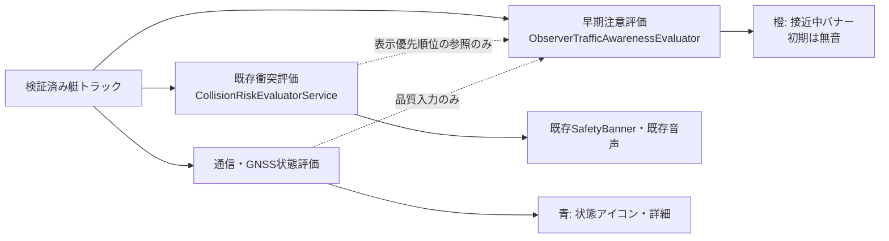
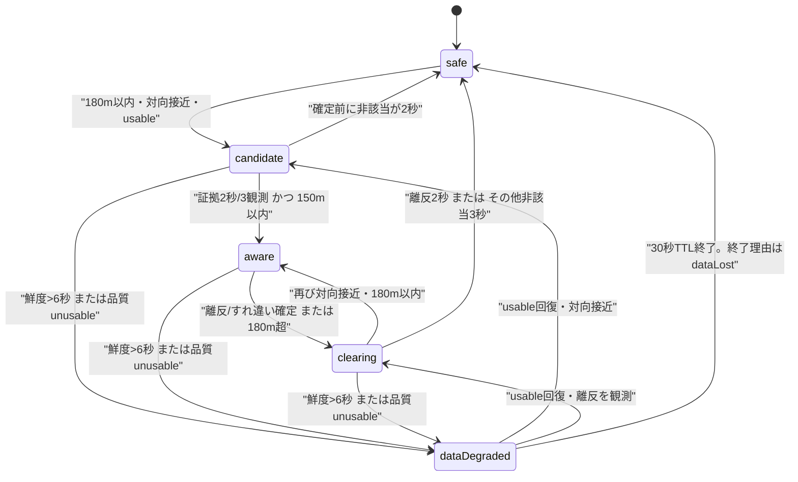

# 監視モード警告・艇間早期注意喚起 要件定義と実装計画

- 作成日: 2026-08-03
- 更新日: 2026-08-03
- 対象: Rowing Navigator 桜川版
- 状態: **設計案を具体化済み・実装は未着手**
- 上位規範: `docs/DESIGN_PRINCIPLES.md`
- 対象機能: 監視者向け150m艇間早期注意、監視用逆走表示、監視用状態表示
- 対象外: 既存の衝突警報の判定・閾値・音声、法的な操船指示、自動回避

> 本機能は「衝突する」と断定する警報ではない。監視者が、対向して接近する艇群を早めに見つけ、目視確認するための注意喚起である。正常な対向すれ違いでも表示され得るが、音は鳴らさず、既存の衝突警報とは別の橙色表示にする。

---

## 0. 用語、要求の解釈、未検証事項

### 0.1 用語

| 用語 | 本書での意味 |
| --- | --- |
| 早期注意 | 対向して接近する2艇以上が150m以内にいることを監視者へ知らせる表示。衝突危険の断定ではない |
| 既存衝突警報 | 船体・安全領域・将来運動・GNSS不確実性を用いる既存の安全機能。本書では変更しない |
| 地理距離 `d_geo` | 同じ評価時刻へそろえた2艇の中心間の平面近似距離[m] |
| 航路距離 `d_route` | 同一の検証済み中心線へ投影した2艇の `alongMeters` の差の絶対値[m] |
| 接近速度 `c` | 2艇を結ぶ直線方向の距離減少率[m/s]。正が接近、負が離反 |
| TCPA / DCPA | 現在の相対速度を一定とした場合の最接近時刻[s] / 最接近距離[m]。参考指標であり衝突判定ではない |
| usable観測 | 鮮度・座標・accuracy・速度・方位が、本書の早期注意分類に使える観測 |
| data degraded | データが不足・劣化し、現在の対向接近の有無を確定できない状態。安全を意味しない |

### 0.2 「150m以内なら注意」の正式な解釈

必須要件は次のように解釈する。

1. **表示中の早期注意は、必ず現在推定中心間距離 `d_geo <= 150m` を一度満たして成立する。**
2. 150mより外側では、表示しない。ただし180m以内で対向・接近の確認を非表示で先に始めてよい。
3. 2艇が対向・接近していることをusable観測で確認できた場合、150mへ入った時点で橙バナーを表示する。
4. 通信断、方位不明、回頭中、著しいGPS劣化では「対向して接近している」と確定できないため、新規表示を作らない。その代わり、データ劣化を別の状態表示にする。
5. 150mは危険境界ではない。DCPAが小さい、既存衝突警報が出た、などを理由に既存警報を150mへ拡張しない。

項目4は、物理的には150m以内であっても新規早期注意が出ない可能性を残す。この制約を外すと、通信断艇・停止艇・方位が揺れる艇まで大量に表示され、早期注意が形骸化する。したがってこれは「150m以内の**対向接近を確認できた組**を表示する」という品質条件であり、既存衝突警報を抑制する条件ではない。

### 0.3 未検証事項

以下はコードまたは現地ログで最終確認が必要であり、現時点では**未検証**である。

- 桜川の全航行区間で、2本のレーンと中心線の対応付けが連続して利用できるか。
- 送信される `courseAccuracy`、`speedAccuracy`、`turnRate` の実機での欠損率と安定性。
- iOS/Androidが返す `accuracy` の統計的意味が端末間で同一か。本書では確率へ変換せず品質帯としてだけ使う。
- 回頭判定の初期値 `12deg/s` が、通常のカーブ航行を回頭と誤認しないか。
- 監視者が橙バナーを見て実際に早く状況把握できるか、および正常すれ違いの表示頻度を許容できるか。

---

## 1. 結論と推奨アーキテクチャ

### 1.1 結論

推奨案は、単純な距離・方位差だけでも、TCPA/DCPAだけでもない。次の二段階判定とする。

1. **遭遇分類層**: 検証済みレーン・中心線が使える区間では、中心線に沿う進行成分の符号から「対向」を分類する。使えない区間だけ方位差120度以上へ縮退する。停止・回頭・方位不明は別分類にする。
2. **早期注意層**: 180m以内で対向・接近の事前確認を開始し、usableな証拠が2秒以上・3観測そろったうえで、`d_geo <= 150m` になったら表示する。TCPA、DCPA、航路距離は表示優先順位・詳細説明・ログに使うが、正常な対向艇をDCPAだけで除外しない。

この方式により、カーブで2艇の地理方位差が一時的に120度未満でも、同じ航路を逆向きに進んでいれば対向と判定できる。一方、中心線が無い場所でも単純判定へ縮退できる。

### 1.2 三つの安全経路を分離する



- 早期注意は、既存衝突警報の候補・状態機械・音声を変更しない。
- 既存衝突警報が同じペアに出ている場合、UIでは既存衝突警報を上位にする。早期注意の内部記録は残してよいが、衝突警報を隠さない。
- 通信/GPS劣化は、早期注意を「安全」へ変える証拠にしない。新規確定を止め、既存表示を短時間保持し、その後は「情報更新待ち」として状態系へ引き継ぐ。
- 早期注意の純粋評価部はUI、Firebase、音声、Timerに依存させない。評価時刻と前回状態を明示入力する。

### 1.3 既存コードとの接続境界

実装時の入力元は画面用 `Boat` の一覧ではなく、`OtherBoatTrackStore` が返す検証済みトラック相当の専用DTOとする。理由は、現行 `Boat` へ変換すると `courseAccuracy`、`speedAccuracy`、`turnRate`、厳密な鮮度区分が失われるためである。

再利用候補:

- `OtherBoatTrackStore`: `serverUpdatedAt` を用いた単調増加の鮮度。現行は3秒未満がfresh、3〜6秒がdegraded、6秒以降は予測に使わない。
- `RemoteBoatMessage`: 座標、speed、course、accuracy、`courseAccuracy`、`speedAccuracy`、`turnRate` の検証済み入力。
- `ChannelLaneResolver` / `ChannelCenterline`: レーン解決、同じ中心線への投影、`alongMeters`、`crossMeters`、接線方位。
- `ShipDomainService.headingIsReliable`: 0.5m/s未満の方位を信頼しない既存方針。早期注意でも同じ最低速度を初期値とする。

新設候補:

- `lib/services/observer_traffic_awareness_evaluator.dart`: 瞬間特徴量、遭遇分類、ペア状態機械、連結成分をまとめる純粋Dart部品。
- `lib/models/observer_traffic_snapshot.dart`: 入力・ペア出力・グループ出力・理由コード。
- `lib/config/observer_awareness_config.dart`: 本書の数値と根拠を一か所に置く。
- `test/services/observer_traffic_awareness_evaluator_test.dart`: 状態遷移と数式の単体テスト。

---

## 2. 少なくとも3案の比較

| 案 | 概要 | 見逃し | 誤報 | 説明可能性 | 計算量（12艇） | カーブ耐性 | 実装難度 |
| --- | --- | --- | --- | --- | --- | --- | --- |
| A. 距離 + 方位差 | `d<=150m`、速度0.5m/s以上、方位差120度以上 | **中〜高**。カーブで対向艇の方位差が小さくなる | 中。方位揺れ、回頭、境界揺れに弱い | 高 | O(66)で非常に小さい | 低 | 低 |
| B. 相対速度 + TCPA/DCPA | 直線等速の相対運動から接近・最接近を評価 | 中。カーブで直線仮定が外れる | 中。直線外挿が外岸を横切る | 高 | O(66)で小さい | 低〜中 | 中 |
| C. 航路中心線・レーン | 中心線の曲線座標と進行符号で対向遭遇を分類 | 低。中心線が正しければカーブに強い | 低〜中。中心線の端・レーン境界では不確か | 高 | 投影込みでO(66×中心線区間数)。12艇なら十分小さい | 高 | 中〜高 |
| D. ロバスト品質ゲート | accuracy、鮮度、方位精度、複数観測を使い、確率値へ変換せず品質帯で判定 | 品質ゲートが厳しすぎると増える | 低。単発ノイズを抑えやすい | 高 | O(66)で小さい | 単独では中 | 中 |
| E. 確率的衝突確率 | 誤差分布を仮定し、接近確率を計算 | 仮定が正しければ低い | accuracyの意味・相関が誤ると不安定 | 中 | 66ペアなら可能 | モデル次第 | 高 |

採用するのは **C + Dを入口、Aを縮退、Bを補助** とする組合せである。Eは端末のaccuracyを確率分布として校正できていないため初期実装では採用しない。既存衝突警報は別系統であり、この比較の置換対象ではない。

---

## 3. 推奨する正式な判定仕様

### 3.1 入力

1艇につき次を受け取る。値はすべて検証済みでなければならない。

| フィールド | 型・単位 | 用途 |
| --- | --- | --- |
| `boatId`, `displayName` | 文字列 | 安定したペアID、表示 |
| `sessionId`, `sequence` | 文字列、非負整数 | 同じ受信点を評価周期ごとに重複して観測数へ加えないための識別子 |
| `position` | 緯度経度 | 地理距離、中心線投影 |
| `speed` | m/s | 停止判定、速度ベクトル |
| `course` | 北0度・時計回り、0〜360度 | 進行方位。艇首方位ではなく対地進路 |
| `accuracy` | m、正数 | 位置品質帯。距離閾値の水増しには使わない |
| `courseAccuracy` | 度、任意 | 方位品質。欠損時は時系列安定性へ縮退 |
| `speedAccuracy` | m/s、任意 | 同期外挿の品質評価 |
| `turnRate` | deg/s、任意 | 回頭分類。欠損時は方位履歴から求める |
| `serverUpdatedAt` | UTC | 鮮度の唯一の基準。端末時計の `observedAt` は鮮度に使わない |
| `lane`, `centerline` | 任意 | 検証済みのレーンと明示的に関連付いた中心線 |
| `previousSamples` | 最大3〜5秒 | 方位安定性、回頭、観測連続性 |

評価入力全体:

- `evaluationTime`: 推定サーバー時刻と整合する現在時刻。
- `previousPairStates`: ペアIDごとの状態。Timerを内部に持たせない。
- `existingCollisionPairIds`: 監視端末で取得できる場合だけ渡す任意情報。表示優先順位と詳細表示のための読み取り専用であり、欠損しても早期注意を評価できること。早期注意の成立条件にはしない。
- `config`: 数値設定。実装中に直書きしない。

### 3.2 時刻同期と鮮度

各艇の齢を次で求める。

```text
age_i = evaluationTime - serverUpdatedAt_i
```

- `age < 0`: 不正時刻としてその観測を拒否する。
- `0 <= age < 3s`: fresh。
- `3s <= age <= 6s`: degradedだが、新規早期注意へ使用可能。理由コード `freshness_degraded` を残す。
- `age > 6s`: 位置予測へ使わない。新規candidate/awareを作らず `dataDegraded` とする。

2艇の位置は同じ `evaluationTime` へそろえる。外挿時間は各艇について `min(age, 6s)` までとし、それを超える直線外挿は禁止する。

1. 同じ検証済み中心線へ投影でき、進行成分が十分なら、中心線に沿って短時間外挿する。
2. それ以外は現在のcourseとspeedで6秒以下だけ直線外挿する。
3. 6秒を超えた観測は、表示用の最終位置として残しても、早期注意の幾何計算には使わない。

### 3.3 accuracyと方位品質

位置の相対不確実性の記録値を次で求める。

```text
u_rel = sqrt(accuracy_A^2 + accuracy_B^2)
```

初期品質帯:

| 品質 | 条件 | 早期注意への扱い |
| --- | --- | --- |
| good | 各艇 `accuracy <= 15m` かつ `u_rel <= 22m` | 通常どおり使用 |
| degraded usable | 各艇 `accuracy <= 25m` かつ `u_rel <= 36m` | 使用可。確定時間を伸ばさず、理由コードとログを残す |
| unusable | どちらか `accuracy > 25m`、欠損、不正 | 新規確定しない。data degradedへ |

25m、36mは**未検証の初期値**である。GPS誤差を距離閾値へ足して `150 + u_rel` とすると、典型的な15m同士でも約171mから表示され、150m要件を壊すため採用しない。逆に `d_geo + u_rel <= 150` を要求すると、典型的な15m同士で約129mまで表示が遅れるため採用しない。accuracyは閾値の拡大・縮小ではなく、観測を分類可能かの品質ゲートとログに使う。

方位をusableとする条件:

- `speed >= 0.5m/s`。
- `courseAccuracy` がある場合は `<=45deg`。
- 欠損時は、直近3観測が2秒以上を覆い、円周上の最大方位偏差が25度以下であること。
- `turnRate` の絶対値が12deg/s以上、または3秒間の方位変化が36度以上なら `turning` とし、対向を新規確定しない。

45度、25度、12deg/sは**未検証**であり、通常カーブと折返しのログで調整する。

### 3.4 座標と数式

桜川の局所範囲では、2艇を共通の局所東北座標[m]へ変換する。

```text
p_A = (east_A, north_A)
p_B = (east_B, north_B)
v_i = speed_i * (sin(course_i), cos(course_i))
r   = p_B - p_A
v_r = v_B - v_A
d_geo = |r|
```

接近速度は次とする。

```text
c = -(r dot v_r) / max(|r|, epsilon)
```

- `c > 0`: 距離が縮小。
- `c < 0`: 距離が拡大。
- 初期の「接近中」根拠は `c >= 0.5m/s` とする。
- 同じ中心線上で両艇の進行符号が逆かつ航路上の間隔が縮小している場合は、カーブのため直線 `c` が小さくても接近中とする。

相対速度が十分な場合だけ参考値を計算する。

```text
t_cpa_raw = -(r dot v_r) / |v_r|^2
t_cpa = clamp(t_cpa_raw, 0s, 30s)
d_cpa = |r + v_r * t_cpa|
```

- `|v_r| < 0.5m/s` のときTCPA/DCPAは `unknown`。
- `t_cpa_raw < 0` は既に離反している根拠になり得る。
- 30秒上限は優先順位表示の暴走防止であり、30秒先の衝突を保証する予測ではない。
- DCPAが大きいことを理由に対向早期注意を抑制しない。正常なレーンすれ違いを知らせること自体が本機能の目的だからである。

### 3.5 航路中心線とカーブ

両艇が同じ明示的な `centerlineId` に投影できる場合:

```text
s_i = frame_i.alongMeters
q_i = speed_i * cos(course_i - tangentBearing_i)
d_route = |s_B - s_A|
route_closing = -sign(s_B - s_A) * (q_B - q_A)
```

- `q_A` と `q_B` の符号が逆で、`|q_i| >= 0.5m/s`、`route_closing >= 0.5m/s` なら `opposing`。
- 符号が同じなら `sameDirection`。後方艇が速くても初期の早期注意対象外とする。
- `|q_i| < 0.5m/s`、中心線からの横成分が速度の50%以上、中心線端、レーン重複、別centerlineなら、中心線だけでは確定しない。
- `d_route` はカーブ先の順序・優先順位・推定遭遇時間に使う。**表示の150m必須ゲートは `d_geo <= 150m` のまま**とする。
- 中心線が使えない場合は、方位差・直線接近速度へ縮退する。縮退を機能停止にしてはならない。

直線方位差は次で正規化する。

```text
delta = abs(((course_A - course_B + 180) mod 360) - 180)  // 0..180deg
```

### 3.6 遭遇分類

分類は次の順序で行い、最初に成立したものを返す。

| 優先 | 分類 | 条件 | 新規早期注意 |
| --- | --- | --- | --- |
| 1 | `communicationLost` | どちらか `age > 6s` | 作らない。状態系へ |
| 2 | `stopped` | どちらか `speed < 0.5m/s` | 作らない。単発の速度揺れはペア状態機械の時間条件で吸収する |
| 3 | `turning` | どちらかが回頭条件を満たす | 作らない |
| 4 | `headingUnknown` | 方位品質を満たさない | 作らない |
| 5 | `opposing` | 同一中心線上で進行符号が逆かつ接近、または縮退時に `delta>=120deg` かつ `c>=0.5m/s` | 対象 |
| 6 | `sameDirection` | 中心線進行符号が同じ、または `delta<=60deg` | 初期は対象外 |
| 7 | `crossing` | `60deg<delta<120deg`、中心線横成分が大きい | 初期は対象外。詳細ログには残す |
| 8 | `laneUnknown` | 幾何はusableだがレーン/中心線が使えず縮退判定も確定しない | 作らない |

レーン不明でも、方位差と接近速度が明確なら縮退して `opposing` としてよい。レーン不明それ自体を通信断と同じにしない。

### 3.7 150mの入口と180mの事前確認

新規表示の条件を次の論理式とする。

```text
prearmEvidence = usable(A, B)
              && encounter == opposing
              && (d_geo <= 180m)
              && closingEvidence

showAware = prearmEvidence persisted >= 2s with >= 3 observations
         && d_geo <= 150m
```

ここで1観測とは評価関数を1回呼んだことではなく、`(sessionId, sequence)` の組が前回から変わった**異なる受信点**を含む評価をいう。同じFirebaseスナップショットを1Hzで3回再評価しても3観測に数えない。ペア状態には、最後に数えた両艇の観測キーを保存する。

重要点:

- 150〜180mは**非表示のpre-arm領域**である。監視者には何も出さない。
- 180mより外から正常に近づく組は、150mへ入る前に2秒確認を終え、150mへ入った最初のusable観測で表示できる。
- 最初に受信した時点で既に150m以内なら、2秒・3観測を待ってから表示する。
- 既存衝突警報が有効でも、早期注意の品質条件を飛び越えて新規表示しない。既存衝突警報自身が上位表示を担う。
- 評価周期が遅延して151mから149mへ飛んだ場合、149mの観測で150m内へ入ったと判断する。補間で架空の正確な越境時刻を作らない。

---

## 4. 状態機械とヒステリシス

### 4.1 ペア単位の状態



`safe` は「物理的に安全」を意味せず、「現在、表示可能な対向接近の証拠がない」という内部名である。UIへ `安全` と表示してはならない。

### 4.2 状態別の保持情報

| 状態 | 橙バナーの辺 | 状態アイコン | 必須保持値 |
| --- | --- | --- | --- |
| `safe` | なし | 必要時のみ | 最終終了理由 |
| `candidate` | なし | なし | `candidateSince`、観測数、理由コード |
| `aware` | あり | 品質低下が併存すればあり | `awareSince`、最小距離、TCPA、実際の辺 |
| `clearing` | あり | なし | `clearingSince`、解除根拠 |
| `dataDegraded` | 直前がawareなら最大5秒だけ保持し `情報更新待ち` を付記 | あり | 直前状態、劣化開始、最終usable時刻 |

### 4.3 確定・解除の正式値

| 動作 | 初期値 | 根拠 |
| --- | --- | --- |
| candidate開始 | `d_geo <= 180m` | 150m到達前に確認を終える。表示はしない |
| aware確定 | 2秒以上かつ3 usable観測、`d_geo <=150m` | 1Hzで単発・2点飛びを抑えつつ、150m内での追加遅延を減らす |
| 離反解除 | `c <= -0.5m/s` または航路上で通過後、2秒かつ3観測 | すれ違い後に180mまで残り続けるのを防ぐ |
| 距離解除 | `d_geo >180m`、3秒かつ3観測 | 30mの距離ヒステリシス |
| その他解除 | opposingでないusable観測が3秒かつ3観測 | 方位揺れ1点で消さない |
| data degraded橙保持 | 最大5秒 | 通信断で即座に消えて安全に見えることを防ぐ |
| 予測不能トラック保持 | 現行の表示TTL 30秒 | 橙保持後も状態詳細へ「最終更新からN秒」として残す |

評価時刻が巻き戻った場合、その評価を状態時間の進行に使わない。観測間隔が1.5秒を超えた場合、連続観測数はつなげず、候補をdata degradedとして扱う。

ペア状態には両艇の `sessionId` も保存する。どちらかのsessionが変わった場合、旧sessionのcandidate時間・観測数・通過判定を新sessionへ引き継がず、freshなcandidateからやり直す。旧sessionでawareだった事実は終了理由 `sessionChanged` としてログへ残し、物理的な解消とは記録しない。

### 4.4 点滅と対象入替えへの対策

- 149〜151mの揺れ: aware成立後は150mを越えても直ちに消さず、離反または180m超の解除条件まで保持する。
- 方位119〜121度の揺れ: 中心線分類を優先する。縮退時も3秒の非該当を要求する。
- すれ違い: 方位が反転したように見えることだけで解除せず、距離増加または航路上の順序交差を2秒確認する。
- A-BからA-Cへの入替え: ペア状態を独立保持し、グループ表示はactiveな辺から毎秒再構築する。艇名順の瞬間変化だけで新しい通知扱いにしない。
- 通信断: 橙表示を5秒保持した後、青い状態アイコンへ移す。消滅理由を `cleared` ではなく `dataLost` としてログに残す。

---

## 5. 3艇以上のグループ化

### 5.1 連結成分を採用する

awareまたはclearingにあるペアを無向辺、艇を頂点とし、連結成分を1つの接近グループとする。この方式は最大12艇・66ペアで単純、決定的、説明可能であり妥当である。

ただし、連結成分は推移的な危険を意味しない。A-BとB-Cが成立し、A-Cが成立しない場合:

- 主バナー: `接近中：A艇・B艇・C艇`
- 詳細: `A艇 ↔ B艇`、`B艇 ↔ C艇` の2辺だけを表示する。
- A-Cに対向関係がある、または3艇が同じ地点で衝突する、とは表示しない。

### 5.2 複数グループをバナー1本へ圧縮する

グループの優先順位は決定的に次で並べる。

1. 既存衝突警報と重なるペアを含む。
2. 有効な推定遭遇時間が短い。
3. `d_geo` の最小値が小さい。
4. 最初にawareになった時刻が早い。
5. 最小の正規化ペアIDの辞書順。

表示規則:

- 1グループ・3艇以下: `接近中：A艇・B艇・C艇`
- 1グループ・4艇以上: `接近中：A艇・B艇・C艇・ほかN艇`
- 2グループ以上: 最優先グループを同じ形式で示し、末尾に `・ほかN組`
- バナーは橙色1本だけ。タップで全グループの詳細を開く。

詳細画面には、グループごとに艇名、実在する辺、現在距離、航路距離、接近速度、データ齢、accuracy、分類根拠、状態を表示する。DCPAは `直線参考値` と明記する。

グループIDは `sort(boatIds).join('|')`、ペアIDは `minId|maxId` とする。グループ構成が変わればIDは変わるが、UIはペアの `awareSince` を使い、同じ辺が残る限り点滅や再通知を起こさない。

---

## 6. 具体的な擬似コード

### 6.1 純粋評価関数

```text
function evaluateObserverAwareness(input, previousStates, config): Result
    now = input.evaluationTime
    boats = sortByBoatId(input.validatedTracks).takeAtMost(12)
    synced = map boats -> synchronizeTrack(track, now, config.maxAge=6s)
    nextStates = emptyMap()
    pairOutputs = []

    for i in 0 .. synced.length-2:
        for j in i+1 .. synced.length-1:
            a = synced[i]
            b = synced[j]
            pairId = min(a.id,b.id) + "|" + max(a.id,b.id)
            pairToken = PairObservationToken(
                sessionA=a.sessionId, sequenceA=a.sequence,
                sessionB=b.sessionId, sequenceB=b.sequence)
            previous = previousStates.getOrDefault(pairId, PairState.safe())

            features = computeFeatures(a, b, input.channelIndex, config)
            // featuresは距離、品質、遭遇分類、closing、TCPA/DCPA、理由コードを含む
            next = transitionPair(previous, features, now, config, pairToken)
            nextStates[pairId] = next

            if next.state in {aware, clearing}:
                pairOutputs.add(toPairOutput(pairId, a, b, features, next))
            else if next.state == dataDegraded and next.holdOrangeUntil >= now:
                pairOutputs.add(toDegradedHeldOutput(pairId, a, b, next))

    // 入力から消えた以前のactive pairも、dataLostとしてTTLまで進める
    for (pairId, previous) in previousStates not in nextStates:
        next = transitionMissingPair(previous, now, config)
        if not next.isExpired:
            nextStates[pairId] = next
            if next.shouldHoldOrange(now):
                pairOutputs.add(toMissingHeldOutput(pairId, next))

    edges = filter pairOutputs where output.visibleInOrangeBanner
    groups = connectedComponents(edges)       // DFSまたはUnion-Find
    groups = sortGroupsDeterministically(groups)

    return Result(
        pairStates = immutable(nextStates),
        pairs = immutable(sortByPairId(pairOutputs)),
        groups = immutable(groups),
        banner = compressToOneBanner(groups),
        dataIssues = collectDataIssues(synced, nextStates)
    )
```

### 6.2 特徴量と分類

```text
function computeFeatures(a, b, channelIndex, config): Features
    if a.age > 6s or b.age > 6s:
        return Features(unusable, communicationLost, reason="stale")
    if invalid(a.accuracy) or invalid(b.accuracy):
        return Features(unusable, dataUnknown, reason="accuracy_invalid")

    pA, pB = synchronizedLocalPositions(a, b)
    vA = velocity(a.speed, a.course)
    vB = velocity(b.speed, b.course)
    r = pB - pA
    vr = vB - vA
    dGeo = norm(r)
    closing = -dot(r, vr) / max(dGeo, 0.001)
    tcpa, dcpa = straightCpa(r, vr, maxHorizon=30s)
    relativeUncertainty = hypot(a.accuracy, b.accuracy)

    quality = classifyQuality(a, b, relativeUncertainty)
    if quality == unusable:
        return Features(quality, dataUnknown, dGeo, closing, tcpa, dcpa)
    if a.speed < 0.5 or b.speed < 0.5:
        return Features(quality, stopped, dGeo, closing, tcpa, dcpa)
    if isTurning(a) or isTurning(b):
        return Features(quality, turning, dGeo, closing, tcpa, dcpa)
    if not headingUsable(a) or not headingUsable(b):
        return Features(quality, headingUnknown, dGeo, closing, tcpa, dcpa)

    frameA = projectToExplicitCenterline(a, channelIndex)
    frameB = projectToExplicitCenterline(b, channelIndex)
    if frameA.valid and frameB.valid and frameA.centerlineId == frameB.centerlineId:
        qA = alongVelocity(a, frameA.tangent)
        qB = alongVelocity(b, frameB.tangent)
        dRoute = abs(frameB.along - frameA.along)
        routeClosing = -sign(frameB.along-frameA.along) * (qB-qA)
        if sign(qA) != sign(qB) and abs(qA)>=0.5 and abs(qB)>=0.5
           and routeClosing>=0.5:
            return Features(quality, opposing, dGeo, dRoute,
                            closing, routeClosing, tcpa, dcpa,
                            reason="channel_opposing")
        if sign(qA) == sign(qB):
            return Features(quality, sameDirection, ...)

    delta = shortestHeadingDifference(a.course, b.course)
    if delta >= 120 and closing >= 0.5:
        return Features(quality, opposing, dGeo, closing, tcpa, dcpa,
                        reason="heading_fallback")
    if delta <= 60:
        return Features(quality, sameDirection, ...)
    if delta > 60 and delta < 120:
        return Features(quality, crossing, ...)
    return Features(quality, laneUnknown, ...)
```

### 6.3 状態遷移

```text
function transitionPair(prev, f, now, c, pairToken): PairState
    monotonicNow = max(now, prev.lastEvaluationAt)

    if prev.hasSessionIds and prev.sessionIds != pairToken.sessionIds:
        prev = safe(endReason="sessionChanged")

    if f.quality == unusable or f.encounter == communicationLost:
        return enterOrContinueDataDegraded(prev, monotonicNow,
            orangeHold=5s, totalTtl=30s, endReason="dataLost")

    evidence = f.encounter == opposing
            and f.dGeo <= 180
            and (f.closing >= 0.5 or f.routeClosing >= 0.5)

    switch prev.state:
      safe:
        if evidence:
            return candidate(since=now, observations=1,
                             lastPairToken=pairToken,
                             sessionIds=pairToken.sessionIds)
        return safe(lastEvaluationAt=now)

      candidate:
        if evidence:
            p = prev.addUsableObservationOnlyIfPairTokenChanged(
                    now, pairToken)
            if p.elapsed>=2s and p.observations>=3 and f.dGeo<=150:
                return aware(since=now, evidenceSince=p.since)
            return p
        return prev.nonMatchFor(now)>=2s ? safe() : prev

      aware:
        if evidence:
            return prev.refreshMetrics(f, now)
        if isConfirmedDivergingOrPassed(f):
            return clearing(since=now, reason="passed_or_diverging")
        if f.dGeo > 180:
            return clearing(since=now, reason="distance_exit")
        return clearing(since=now, reason="classification_changed")

      clearing:
        if evidence and f.dGeo<=180:
            return aware(keepOriginalAwareSince=true)
        required = prev.reason=="passed_or_diverging" ? 2s : 3s
        if prev.elapsed>=required and prev.usableObservations>=3:
            return safe(endReason=prev.reason)
        return prev.addUsableObservationOnlyIfPairTokenChanged(now, pairToken)

      dataDegraded:
        if evidence:
            // 劣化中の経過時間は確定時間へ加えない
            return candidate(since=now, observations=1,
                             lastPairToken=pairToken,
                             sessionIds=pairToken.sessionIds)
        if isConfirmedDivergingOrPassed(f):
            return clearing(since=now, reason="recovered_diverging")
        return safe(endReason="recovered_without_opposing_evidence")
```

計算量はペア評価O(N²)、連結成分O(N+E)で、N=12、E<=66である。中心線投影は艇ごとに先に1回キャッシュし、ペアごとに全中心線を走査しない。入力順に関係なく、boatIdで整列して同じ結果を返すことをテストする。

---

## 7. 数値の初期候補と感度分析

### 7.1 推奨初期値

| 項目 | 素朴案 | 推奨初期値 | 許容検討範囲 | 小さく/緩くした場合 | 大きく/厳しくした場合 |
| --- | --- | --- | --- | --- | --- |
| 方位差 | 120度 | 縮退判定で120度 | 110〜135度 | カーブ見逃し減、横断誤認増 | 誤認減、カーブ見逃し増 |
| 最低速度 | 0.5m/s | 0.5m/s | 0.4〜0.8m/s | 停止・漂流時の方位誤認増 | 低速航行の見逃し増 |
| 表示距離 | 150m | **150m固定** | 要件変更時のみ | 早く・表示頻度増 | 遅く・監視猶予減 |
| pre-arm | なし | 180m、非表示 | 170〜200m | 150m内で確認待ち増 | 不要な候補計算・状態保持増 |
| 距離解除 | 180m | 180m | 170〜200m | 境界点滅増 | 表示残留時間増 |
| 確認 | 2〜3秒 | 2秒かつ3観測 | 2〜3秒 | 誤確定増、表示は早い | 10m/sで最大30m遅れる |
| 通常解除 | 3〜5秒 | 3秒かつ3観測 | 2〜5秒 | 点滅増 | 古い対象が残る |
| 通過解除 | 未定 | 2秒かつ3観測 | 1〜3秒 | 1点離反で消える | すれ違い後に長く残る |
| 接近速度 | 未定 | 0.5m/s以上 | 0.3〜1.0m/s | ノイズ候補増 | 緩いカーブ・低速接近の見逃し増 |
| accuracy usable上限 | 未定 | 各艇25m | 20〜35m | 厳しくすると欠測時の見逃し増 | 緩くすると誤分類増 |
| 回頭率 | 未定 | 12deg/s | 8〜18deg/s | 通常カーブを回頭扱い | 折返し中の誤表示増 |

150m、既存衝突警報非干渉、初期無音は必須要件であり、現地調整で勝手に変更しない。

### 7.2 150m/100mから最接近までの概算

単純に距離を相対速度で割った値であり、減速・カーブ・すれ違い横距離を無視した概算である。

| 相対速度 | 150mから | 100mから | 150m→100m |
| --- | ---: | ---: | ---: |
| 6m/s | 25.0秒 | 16.7秒 | 8.3秒 |
| 8m/s | 18.8秒 | 12.5秒 | 6.3秒 |
| 10m/s | 15.0秒 | 10.0秒 | 5.0秒 |

150m内に入ってから3秒確認すると、相対速度10m/sでは約30m進み、表示開始が約120m相当まで遅れ得る。したがって、180mから非表示で確認するpre-armを推奨する。

### 7.3 現地で測る値

- 正常な対向すれ違い1回ごとの初回表示距離、初回表示時の残り時間、表示継続時間。
- `courseAccuracy` / `speedAccuracy` / `turnRate` の欠損率と分布。
- 直線区間とカーブ区間の `delta`、`c`、`route_closing` の分布。
- 149〜151m付近の再入場回数、バナーの再生成回数。
- すれ違い後に解除するまでの時間と距離。
- 1練習あたりのグループ表示回数、最大同時艇数、監視者が有用と評価した割合。
- data degradedへ入った回数、橙保持後に通信が戻った割合。
- 既存衝突警報との同時発生回数。両者の意味を監視者が区別できたか。

調整はログから閾値を変えたオフライン再生で比較し、同じログ・同じ設定なら同じ結果になることを確認する。

---

## 8. テスト計画

### 8.1 試験ゲートを分ける

| ゲート | 目的 | 合格条件 |
| --- | --- | --- |
| 単体テスト | 数式、分類、状態機械、グループ化の決定性 | 全境界値、時刻巻戻し、入力順変更を含め成功 |
| ログ再生 | 実測ノイズで表示頻度・点滅・遅延を評価 | 既存警報の再生結果を変えず、理由コード付き結果を保存 |
| 陸上3端末 | 通信、時刻差、3艇連鎖、途絶・復帰を確認 | 期待状態と端末表示が一致し、通信断が安全表示にならない |
| 水上試験 | カーブ・正常すれ違い・監視者の有用性を確認 | 過剰表示、見逃し、解除遅延を記録し、採否判断できる |

コードテスト/CI、RTDB Rules Emulator、本番Rules、署名済みビルド、実機、水上試験は独立した証拠である。いずれか一つの成功を他の完了として扱わない。

### 8.2 具体的ケース

| # | レベル | ケース | 入力・操作 | 期待結果 |
| ---: | --- | --- | --- | --- |
| 1 | 単体 | 151m→149m | 180m内で対向証拠を2秒蓄積後、151m、149m | 151mでは非表示、149mの最初のusable観測でaware |
| 2 | 単体/再生 | 境界GPS揺れ | aware後に149/151/148/152m | 180m未満かつ離反未確定なら点滅しない |
| 3 | 水上/再生 | 正常な対向すれ違い | 両艇3〜5m/s、正規レーン | 橙表示のみ。既存衝突警報を新設・変更せず、通過後2秒程度で解除 |
| 4 | 単体 | 同方向並走 | 方位差0〜20度、距離20〜100m | `sameDirection`、早期注意なし |
| 5 | 単体/水上 | 追い越し | 同方向、後方艇が速く距離縮小 | 初期版では早期注意なし。ログへ `sameDirection_overtaking` |
| 6 | 単体/陸上 | 回頭 | `turnRate=15deg/s`、一時的に方位差180度 | `turning`、新規awareなし。回頭終了後に再確認 |
| 7 | 単体 | 停止艇 | 片方0.3m/s、他方4m/s | `stopped`、早期注意なし。既存衝突警報は別評価 |
| 8 | 単体 | 方位不明 | `courseAccuracy=80deg` または履歴不安定 | `headingUnknown`、新規awareなし、状態詳細へ品質理由 |
| 9 | 単体/陸上 | 通信断 | aware中に更新齢が6秒超 | 5秒まで情報更新待ち付き橙保持、その後状態アイコン。`safe`とは表示しない |
| 10 | 単体/陸上 | 通信復帰 | dataDegraded後にfreshな対向観測 | 劣化時間を確認時間へ足さずcandidateから再確認 |
| 11 | 単体/陸上 | 3艇連鎖 | A-B、B-C成立、A-C不成立 | 1グループ `A・B・C`。詳細辺は2本だけ |
| 12 | 単体/陸上 | 離れた2グループ | A-BとD-Eが成立 | バナー1本、最優先組 + `ほか1組`。詳細に2グループ |
| 13 | 単体/水上 | カーブ | 地理方位差100度、同一中心線上の進行符号が逆 | 中心線根拠で`opposing`。直線DCPAだけで抑制しない |
| 14 | 単体 | 中心線なし | 方位差150度、`c=6m/s` | 縮退判定で`opposing`、理由 `heading_fallback` |
| 15 | 単体 | レーン境界・重複 | resolverがnull、方位差不十分 | `laneUnknown`、誤って対向確定しない |
| 16 | 単体 | accuracy 5〜15m | 両艇15m、`u_rel≈21.2m` | goodとして使用。150m閾値を171mへ拡大しない |
| 17 | 単体 | accuracy劣化 | 片方30m | 新規awareなし、data degraded。既存衝突警報には干渉しない |
| 18 | 単体 | すれ違い後 | awareからTCPA<0相当、`c=-6m/s`が継続 | clearingを経て2秒/3観測で解除。180mまで残さない |
| 19 | 単体 | 方位119↔121度 | 中心線なし、境界を反復 | 1点で候補確定/解除しない。状態遷移が決定的 |
| 20 | 単体 | 評価順序 | 同じ12艇を異なる入力順で66ペア評価 | ペア、グループ、バナー文言が完全一致 |
| 21 | 単体 | 評価時刻巻戻し | 前回より古いevaluationTime | 確認時間を進めず、誤ってaware/clearにしない |
| 22 | 回帰 | 既存衝突警報 | 既存の衝突・岸・橋・逆走テスト群 | 結果不変。早期注意の状態から既存評価へ書込みなし |
| 23 | 単体 | session交代 | aware/candidate中に片艇のsessionIdとsequenceが初期化 | 旧sessionの時間・観測数を継がず、終了理由 `sessionChanged` を残して再確認 |

### 8.3 陸上3端末試験の手順

1. 3端末をA/B/Cとして同じ監視環境へ接続し、端末時刻は自動設定にする。
2. 位置シミュレーションまたは安全な歩行で、180m外→内、151m→149m、3艇連鎖を再現する。
3. Bだけ通信を切り、6秒、11秒、30秒時点の橙表示・状態アイコン・詳細時刻を記録する。
4. Bの通信を戻し、candidateから再確認されることを確認する。
5. 画面録画と評価ログの時刻を合わせ、表示状態と純粋評価結果を照合する。

### 8.4 水上試験の中止条件

本機能は注意喚起であり、試験のために通常の航行ルールを変えない。意図的な危険接近、急な回避、端末操作を漕手へ要求しない。既存の監視・連絡・安全運用を優先し、ログ取得失敗を理由に試験を継続しない。

---

## 9. 選手向け100m表示の是非

### 9.1 推奨判断

**第1段階は監視者専用に留める。選手向け100m表示は、監視版の水上評価後に別承認する。**

理由:

- 利益: 既存衝突警報より前に対向艇の存在へ注意を向けられる可能性がある。
- 限界: 漕手は端末を操作できず、後方を向いて漕ぐため、表示だけでは視認されない可能性がある。
- リスク: 正常なすれ違いごとに表示され、既存衝突警報・逆走・固定障害物表示への注意を薄める可能性がある。
- 検証順序: まず監視者向けで分類精度、表示頻度、カーブ耐性を測れば、選手へ不要な表示を持ち込まずに済む。

### 9.2 採用する場合の第2段階仕様案

- 同じ純粋評価部を使うが、自艇を含むペアだけを抽出する。
- 表示必須ゲートを `d_geo <=100m` とする。130m程度から非表示pre-armしてよい。
- 文言は艇名を必須にせず `近くに他艇` とする。艇名確認操作を要求しない。
- 初期は表示のみ、無音、振動なし。
- 既存衝突警報、緊急表示、逆走表示より常に低い優先順位とし、競合時は100m表示を隠す。
- 既存衝突警報が解除されても、100m表示の状態を既存警報の解除根拠にしない。
- 100m表示の視認率、警報疲れ、既存表示の見落としを水上で測り、利益が確認できなければ採用しない。

---

## 10. 監視画面全体の表示要件

### 10.1 主画面の三分類

| 区分 | 表示 | 色・形 | 文言例 | 最大数 |
| --- | --- | --- | --- | ---: |
| 逆走 | 上部強調バナー | 赤 + 反転矢印 | `逆走：A艇・B艇` | 1本 |
| 艇間早期注意 | 上部強調バナー | 橙 + 対向矢印 | `接近中：A艇・B艇・C艇` | 1本 |
| 機能・状態 | 小型アイコン | 青 + 情報アイコン + 件数 | `ⓘ 3` | 1個 |

上部バナーは最大2本（逆走1本、接近1本）である。横幅不足時だけ赤、橙の順に2段へする。色だけに意味を持たせず、アイコンと文言を併用する。

### 10.2 逆走

- 既存の航路中心線・レーンの規定方向判定を再利用する。
- 停止・回頭・方位不明・レーン不明では新規逆走表示を出さない。
- 約6秒連続で確定する既存方針を守る。
- 複数艇は赤バナー1本へ集約する。
- 監視の逆走表示が失敗しても、航行側の逆走警告、位置共有、記録を止めない。

### 10.3 状態アイコン

- 0件なら非表示。1件以上なら青い情報アイコンと件数のみを出す。
- 更新途絶、GPS品質低下、低電池、長時間停止などは主バナーへ混ぜない。
- `dataLost` は「接近解消」や「安全」と書かず、`A艇：位置情報を確認できません（最終更新N秒前）` とする。
- タップ後の詳細に艇名、種別、開始時刻、最終更新時刻、観測根拠を出す。
- 長時間停止は休憩・沈・体調不良を区別できない観測事実であり、異常と断定しない。

### 10.4 地図

- 早期注意対象艇の既存マーカーに外周リングを付ける。艇名は維持する。
- 150mの巨大な円を常時描かない。危険境界と誤解され、狭い画面を覆うためである。
- 詳細画面でだけ、実際に成立したペアの細線と現在距離を一時表示してよい。
- バナーのタップで該当グループを表示範囲へ収める。常時追従や画面常時点灯は要求しない。

---

## 11. 採用しない方がよい案と理由

| 採用しない案 | 理由 |
| --- | --- |
| 150m以内の全艇ペアを無条件に表示・発音 | 正常な並走・停止・追越し・近いすれ違いで常時発報し、意味を失う。初期は必ず無音 |
| 既存衝突警報を150mへ拡張 | 早期注意と衝突危険を混同し、既存警報の信頼性を弱める |
| 方位差120度だけで判定 | カーブ、回頭、低速のCOG揺れで見逃し・誤表示が起きる |
| TCPA/DCPAだけで判定 | 直線等速仮定がカーブで外れる。正常なレーンすれ違いをDCPAで除外すると本機能の目的を損なう |
| 6秒を超えた位置を長時間直線外挿 | 通信断後の架空位置を作り、「説明可能な現在情報」でなくなる |
| accuracyを150mへ単純加算 | 典型的な15m同士でも約171mに広がり、150m要件と過剰表示防止を壊す |
| `d_geo + u_rel <=150m` を必須化 | 表示が約129mまで遅れ得て、150m早期注意の利益を損なう |
| 通信断時に即座に表示を消し `safe` とする | 情報欠損を安全の証拠として見せてしまう |
| data degradedの橙バナーを無期限保持 | 既にいないかもしれない艇が地図を占有し続ける。短期保持後は状態表示へ責務を移す |
| A-B、B-CからA-Cも危険と推論 | 連結成分は表示集約であり、存在しない辺を作る根拠ではない |
| オンラインAI・学習済みブラックボックスへ判定委任 | 再現性、説明可能性、オフライン動作、単体テストを満たさない |
| 法的な優先権・操船指示・自動回避を表示 | 本アプリの役割を超え、観測誤差から誤った行動を強制し得る |

### 11.1 要件変更案としてのみ検討できるもの

次は代替実装ではなく、利用者承認が必要な**要件変更案**である。

- 150mより外から橙表示する。
- 対向だけでなく同方向追越し・横断も同じ橙バナーへ含める。
- 監視者または選手へ音・振動を追加する。
- 選手向け100m表示を第1段階へ含める。
- data degraded中も橙表示を5秒より長く保持する。

---

## 12. 実装計画（性能が低い作業者向けの順序）

一度にUI、Firebase、判定を変更しない。各フェーズは前の成果物とテストが通ってから進む。

### フェーズ0: 設計承認

1. 本書の「150mの解釈」「pre-arm 180m」「品質上限25m」「選手版は保留」を利用者が確認する。
2. 実測ログで `courseAccuracy`、`speedAccuracy`、`turnRate` の有無を確認する。
3. 全航路でレーンと中心線の対応範囲を地図・profileテストで確認する。
4. 未検証の数値を `採用初期値` または `ログ取得後に決定` に分類する。

完了条件: 要件変更案と初期実装を混ぜず、未検証値が一覧化されている。

### フェーズ1: 入出力モデルと数式

1. `ObserverBoatTrack`、`PairFeatures`、`EncounterClass`、`PairAwarenessState`、`AwarenessGroup` を定義する。
2. Firebase型、Widget、BuildContext、Timerをimportしない。
3. 局所座標、方位差、closing、TCPA/DCPA、中心線進行成分の小さい単体テストを書く。
4. NaN、Infinity、負のage、同一位置、相対速度0を先にテストする。

完了条件: 状態を持たない特徴量計算が単独で全テスト成功する。

### フェーズ2: 遭遇分類

1. 通信断→停止→回頭→方位不明→中心線対向→縮退対向の順で分類する。
2. 中心線投影は艇ごとに1回キャッシュする。
3. 判定理由を列挙値で返す。表示文言を評価部へ書かない。
4. カーブ、同方向、追越し、横断、レーン不明をテストする。

完了条件: 同じ入力を並べ替えても分類結果が一致する。

### フェーズ3: ペア状態機械

1. `evaluationTime` と前回状態を入力し、次状態を返す関数を作る。
2. 180m pre-arm、150m表示、通過2秒解除、通常3秒解除、data degraded 5秒保持を個別にテストする。
3. 時刻巻戻し、1.5秒超の観測間隔、通信復帰をテストする。
4. UIへ接続する前にログ形式を決める。

完了条件: 149〜151m、119〜121度、通信断復帰で点滅しない。

### フェーズ4: 66ペアとグループ化

1. boatIdで入力を整列し、全ペアを一度ずつ評価する。
2. aware/clearingの辺だけで連結成分を作る。
3. グループ優先順位とバナー圧縮を純粋関数で作る。
4. 12艇66ペア、3艇連鎖、離れた2組をテストする。

完了条件: 1Hzで余裕を持って動作し、入力順に依存しない。

### フェーズ5: 監視UI

1. `ObserverPriorityBanner` と `ObserverStatusIcon` を新設する。
2. 赤1本、橙1本、青アイコン1個の上限をWidgetテストで守る。
3. バナー、詳細、地図リングを接続する。150m円は常設しない。
4. 既存 `SafetyBanner` を変更せず、航行モードの表示回帰を確認する。

完了条件: 2艇・12艇、縦横画面で地図がカードに埋まらない。

### フェーズ6: 状態共有（必要な場合のみ）

初期の早期注意は既存送信フィールドで成立する可能性がある。新しい状態共有は、監視詳細に本当に必要な項目だけ追加する。

1. 後方互換な任意フィールドとcapabilityを定義する。
2. `RemoteBoatMessage`、送受信、監視DTO、RTDB Rulesを別責務で更新する。
3. 旧クライアントが未知フィールドを無視することをテストする。
4. Rules Emulatorを通す。本番Rules反映は別の明示ゲートとする。

### フェーズ7: ログ再生・陸上・水上

1. 単体テスト合格後に既存航跡を再生し、複数閾値を比較する。
2. 陸上3端末で通信断・復帰と3艇連鎖を確認する。
3. 通常運用を変えずに水上で対向すれ違いとカーブを記録する。
4. 第7.3節の指標を集計し、数値を変更する場合は本書とconfigコメントを同時更新する。
5. 監視版の採用判断後にだけ、選手向け100mを別フェーズとして提案する。

---

## 13. 非機能要件と完了条件

- 最大12艇、66ペアを1秒ごとに評価できること。
- 同じ入力、設定、前回状態、評価時刻から同じ出力を返すこと。
- 1ペアの不正値・例外で他の65ペアの評価を失わないこと。不正ペアは理由付きで除外する。
- 評価関数内でネットワーク、ファイル、音声、UI、現在時刻取得を行わないこと。
- 新しい早期注意が、既存の1Hz安全判定、位置共有、航跡記録を遅延・停止させないこと。
- 秘密情報、個人の詳細診断、長期位置履歴を新しい共有データへ追加しないこと。
- 監視モードで画面常時点灯を要求しないこと。
- 法的な操船指示、自動回避、危険の断定を文言に含めないこと。

実装完了の判定は次を別々に記録する。

- [ ] 純粋Dart単体テスト
- [ ] 既存警告回帰テスト
- [ ] 全体テスト・静的解析・CI
- [ ] 必要な場合のみRules Emulator
- [ ] 必要な場合のみ本番Rules反映
- [ ] 署名済みビルド
- [ ] 陸上3端末
- [ ] 水上の正常すれ違い・カーブ
- [ ] 監視者による有用性評価
- [ ] 選手向け100mの別承認

---

## 付録A: 実装着手前チェックリスト

- [ ] 150mは表示ゲート、180mは非表示pre-armであると確認した
- [ ] 既存衝突警報は変更対象外であると確認した
- [ ] `Boat` ではなく品質値を保持する専用DTOを入力にする
- [ ] `serverUpdatedAt` を鮮度基準にし、6秒超を予測しない
- [ ] 中心線分類を優先し、方位差120度は縮退用にする
- [ ] accuracyを150mへ足し引きしない
- [ ] 通信断を `cleared` / `safe` と表示しない
- [ ] A-B、B-Cから存在しないA-C辺を作らない
- [ ] バナーは赤1本・橙1本、状態は青アイコンに分ける
- [ ] 初期版は無音、選手向け100mは保留にする
- [ ] 単体、ログ再生、陸上3端末、水上を別ゲートにする
- [ ] 既存の未コミット差分と本件を混ぜてコミットしない

---

## 14. 実装記録（2026-08-03）

### 実装した内容

- 監視専用の純粋Dart評価器 `ObserverTrafficAwarenessEvaluator` を新設した。最大12艇（66ペア）を1秒ごとに評価し、既存の衝突警報・音声・位置共有送信・航跡記録には接続していない。
- 対向接近は、既存の位置、速度、進行方位、`serverUpdatedAt`、精度だけで判定する。180mで候補化し、150m以内で新しい3観測かつ2秒継続してから表示する。6秒を超えた位置は予測せず、既に表示中だったものだけ最長5秒保持する。
- 航路中心線または既存レーンが使える場所は中心線に沿う進行成分を優先し、使えない場合だけ方位差120度以上と接近速度で縮退判定する。低速（0.5m/s未満）・方位不正・精度25m超・古い位置は新規の橙表示を作らない。
- 逆走は既存の `CollisionRiskEvaluatorService.evaluateReverseGuidance` を再利用し、中心線/レーン上で6秒連続確認してから赤バナーに表示する。中心線またはレーンが得られない場所では、監視用の逆走を新規に推測しない（誤表示防止）。
- 監視画面上部は赤の `逆走：艇名` と橙の `接近中：艇名たち` の最大2本だけにした。3艇以上の接近は、実際に成立したペア辺だけを連結して1グループにまとめる。バナーのタップで艇一覧を開き、先頭対象へ地図を寄せる。
- 既存の更新途絶・長時間停止は、青い情報アイコンへ集約した。アイコンをタップすると既存の艇一覧で内容を確認できる。監視画面にGPS途絶・水域外などの大きい警告バナーは追加していない。

### 要件書からの安全上の限定

- 本実装は既存 `Boat` モデルを入力にした初期版である。`courseAccuracy`、`speedAccuracy`、`turnRate`、時系列リングバッファを送受信モデルへ追加していないため、それらを使う高度な品質ゲート・TCPA/DCPAの主判定は後続フェーズとする。
- 選手向けの100m注意、音・振動、Firebaseの新フィールド、RTDB Rules変更は実装していない。既存の選手向け衝突警報の意味と音声挙動を変えないためである。
- 青アイコンの詳細は、現時点で既存実装が確定できる「更新途絶」と「長時間停止」を表示する。GPS品質などを新たに断定表示することはしていない。

### 検証結果

- 実装コミット: `b97724c feat: add observer traffic awareness banners`（本書には既存の未コミット更新があるため、本書自体はこのコミットへ混在させていない）。
- [x] 純粋Dart単体テスト: 180m/150m、3観測2秒、151m/149m、同方向・停止除外、3艇連結、6秒超の古い位置、逆走6秒確認を追加して成功。
- [x] 既存警告回帰テスト: 監視チップと艇一覧のWidgetテストを含む対象テスト26件が成功。
- [x] 全体テスト・静的解析: ローカル `flutter test` と `dart analyze lib test` は成功。
- [x] CI: PR #2 の `b97724c` に対する CI（run 30779193015）が成功。形式、解析、全テスト、危険プロフィール整合、警告音の検証を含む。
- [ ] 必要な場合のみRules Emulator: 本件でRules/通信形式を変更していないため未実行。
- [ ] 必要な場合のみ本番Rules反映: 未実施。
- [ ] 署名済みビルド: 未実施。
- [ ] 陸上3端末: 未実施。
- [ ] 水上の正常すれ違い・カーブ: 未実施。
- [ ] 監視者による有用性評価: 未実施。
- [ ] 選手向け100mの別承認: 未実施。

### 次の実地検証

1. 3端末で、正常な対向すれ違い・同方向並走・折り返し・通信断復帰を再現し、赤/橙/青の優先度と画面占有を確認する。
2. 保存済み航跡の再生と水上ログで、150m到達前後の表示時刻、誤表示、見逃しを記録する。
3. `courseAccuracy` などの実測値が十分に得られると確認できた後だけ、第6節の専用DTO/後方互換通信拡張を別変更として検討する。
